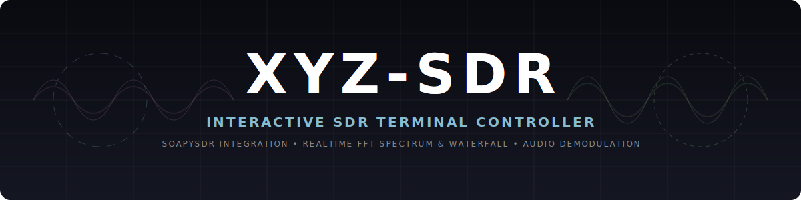
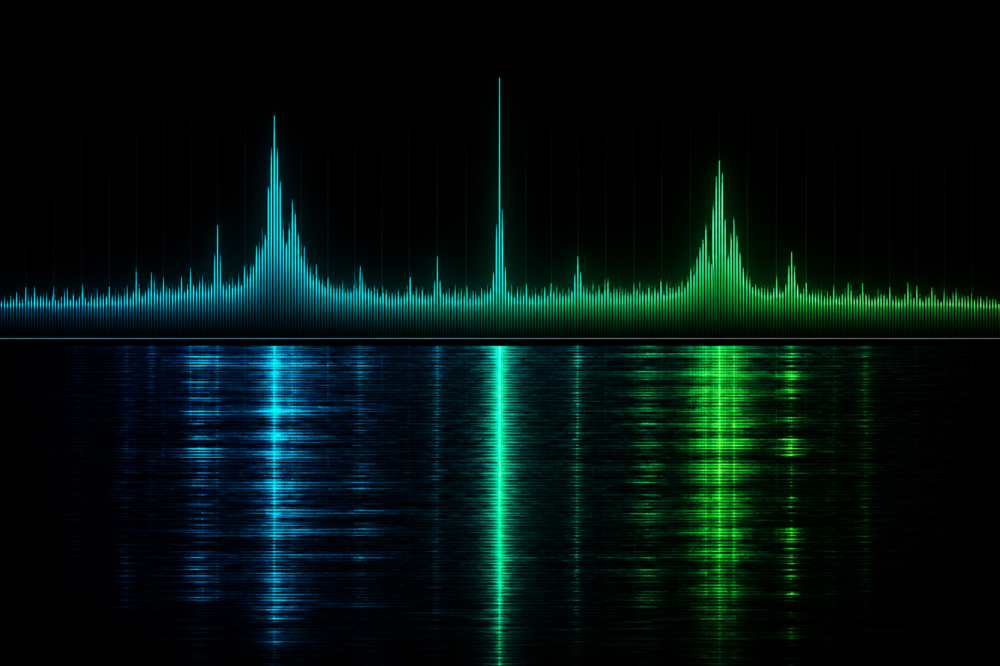
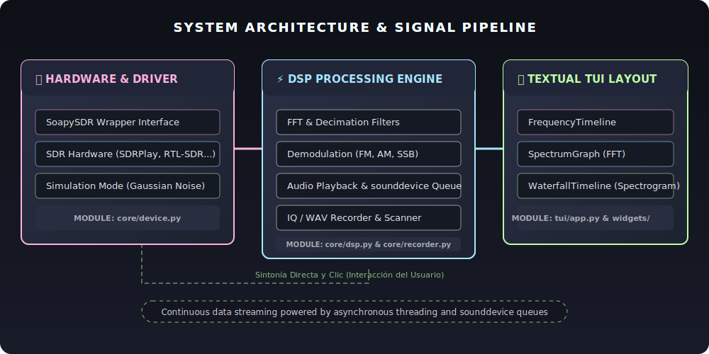
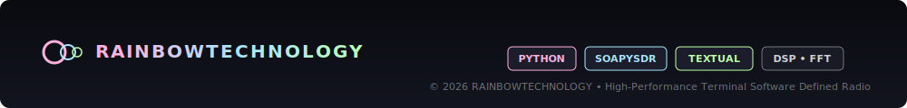

[](https://github.com/<owner>/xyz-sdr/actions/workflows/test.yml)
[](https://github.com/<owner>/xyz-sdr/actions/workflows/lint.yml)
[](https://codecov.io/gh/<owner>/xyz-sdr)

> **Nota:** Reemplazar `<owner>` en los badges con el owner real del repositorio antes de mergear a `main`.

# 🛰️ xyz-sdr — SDR Terminal Controller

> Controlador SDR interactivo en terminal (TUI) de alto rendimiento: timeline + espectro FFT + cascada alineados, perfiles por banda, observabilidad de stream y empaquetado DX en Windows.

---

## Requisitos

| Componente | Detalle |
|------------|---------|
| SO | Windows 10/11 (principal); Linux/macOS vía `scripts/run.sh` |
| Python | **3.9** (Pothos embebido) o **3.11/3.12** en `.venv` del proyecto |
| Hardware | Cualquier dispositivo **SoapySDR** (SDRplay, RTL-SDR, HackRF, Airspy…) |
| Opcional IA | `pip install -r requirements-ai.txt` |

---

[](https://github.com/user-attachments/assets/6bf02f3e-dbbf-41fc-9be9-94ce2defc04c)

---

## Instalación y ejecución rápida

### 1. Entorno (primera vez)

```powershell
.\install-drivers.bat              # atajo raíz (recomendado)
.\install-drivers.ps1
# o directamente:
.\setup\install_drivers.ps1
```

Menú Express: **[1] Instalar o reparar todo** (drivers + Python + `.venv` + verificación).

Instalar solo **SDRplay API v3.15** (offline en `resources/installers/win-x64/` o Downloads):

```powershell
.\setup\install_sdrplay_api.bat
# o menú instalador → [A] Avanzado → [1] SDRplay API
.\setup\install_drivers.ps1
```

### 2. Acceso directo (opcional)

```powershell
.\setup\install_app.ps1              # escritorio
.\setup\install_app.ps1 -StartMenu   # menú inicio
```

También desde la raíz: **`xyz-sdr.bat`** / **`xyz-sdr.ps1`**, o `scripts\xyz-sdr.cmd`.

### 3. Lanzar la app

```powershell
.\xyz-sdr.bat                               # atajo raíz (recomendado)
.\scripts\run.ps1                           # hardware
.\scripts\run.ps1 -Sim                        # simulación sin SDR
.\scripts\run.ps1 -Band fm_broadcast          # perfil FM 88–108 MHz
.\scripts\run.ps1 -Band airband -d            # aviación + métricas
.\scripts\run.ps1 -Check                      # verificar entorno
```

**Preferir `.\scripts\run.ps1`** frente a `python main.py` — usa `.venv`, UTF-8 y preserva flags tras re-exec Soapy. Ver [docs/hardware.md](docs/hardware.md).

**SDRplay — crash al pulsar INICIAR RX:** si la TUI se cierra sola, revisa `var/log/xyz-sdr-*.log` (última línea suele ser `setSampleRate`). Ejecuta `.\scripts\diagnose_sdrplay.ps1` y `python setup/check_env.py --verbose` (línea `sdrplay_rx_preflight`). Cierra SDRuno y reinicia `SDRplayAPIService` antes de reintentar.

---

## Características clave

* **Visualización en 3 capas alineadas** — `FrequencyTimeline`, `SpectrumGraph` (render RLE), `WaterfallTimeline` (ring buffer, auto-level por columna). [display.md](docs/display.md)
* **Perfiles por banda** — `config/bands/*.toml` (FM, airband, PMR, HF); selector **BANDA** en TUI; persistencia en `defaults.toml`. [dx-packaging.md](docs/dx-packaging.md)
* **Bookmarks** — favoritos en `var/bookmarks.toml`; botón **Guardar Bookmark** en sidebar. [configuration.md](docs/configuration.md)
* **Modos demod** — `cw`, `dsb`, `raw`, `auto` (heurística por frecuencia). [dsp.md](docs/dsp.md)
* **Escáner de banda** — barrido configurable `[scanner]`; botón **ESCANEAR BANDA** (RX activo). [configuration.md](docs/configuration.md)
* **Bandwidth IQ** — presets 250 kHz–8 MHz; atajo `B`. [bandwidth.md](docs/bandwidth.md)
* **Observabilidad** — indicador `DROP` en status bar (overflows IQ); `--debug` con `iq drop`, RX/UI timing. [observability.md](docs/observability.md)
* **Interactividad** — teclado + ratón (PASS arrastrable, zoom, scroll). Ver tabla de bindings abajo.

---

## Atajos `scripts/run.ps1`

| Parámetro | Efecto |
|-----------|--------|
| `-Sim` | Modo simulación |
| `-DebugMode` / `-d` | Métricas en panel log |
| `-Band <id>` | Perfil: `fm_broadcast`, `airband`, `pmr446`, `hf_lsb` |
| `-Check` / `-ListDev` | Diagnóstico / listar SDR |
| `-Freq`, `-Mode`, `-Gain`, `-Driver` | Overrides CLI |

Ayuda: `.\scripts\run.ps1 -?` — detalle en [docs/dx-packaging.md](docs/dx-packaging.md).

---

## Layout del repositorio



```
xyz-sdr/
├── main.py
├── config/
│   ├── defaults.toml           # Config base + [app] active_band_profile
│   └── bands/                  # Perfiles por banda (fm_broadcast, airband…)
├── core/
│   ├── device.py               # SoapySDR + StreamStats
│   ├── stream_stats.py         # Métricas drop/overflow
│   ├── band_profiles.py        # Carga/fusión perfiles banda
│   ├── config_store.py         # Persistencia TOML + persist_band_profile()
│   ├── dsp.py / dsp_profiles.py
│   └── …
├── scripts/
│   ├── run.ps1                 # Launcher Windows (atajos)
│   ├── xyz-sdr.cmd             # Doble clic
│   ├── run.sh / test.sh
│   └── test.ps1
├── xyz-sdr.bat                 # Atajo raíz → run.ps1
├── install-drivers.bat         # Atajo raíz → setup/install_drivers.ps1
├── install-drivers.ps1
├── resources/installers/win-x64/  # SDRplay API offline (opcional)
├── setup/
│   ├── install_drivers.ps1     # Wizard drivers + venv
│   ├── install_sdrplay_api.bat # Solo SDRplay API v3.15
│   └── install_app.ps1         # Acceso directo escritorio
├── tui/
└── docs/                       # Índice: docs/README.md
```

---

## Bindings de teclado

| Tecla | Acción |
|-------|--------|
| `←` / `→` | Desplazar sintonía |
| `↑` / `↓` | Ciclar paso de scroll |
| `Ctrl+←/→` | Zoom in/out |
| `Space` | Centrar vista en frecuencia |
| `S` | Iniciar / detener RX |
| `M` | Ciclar modo demod |
| `B` | Enfocar selector bandwidth |
| `[` / `]` | Estrechar / ensanchar PASS |
| `G` / `V` | Ganancia / volumen |
| `Esc` | Menú ajustes |
| `Q` / `Ctrl+Q` / `Ctrl+C` | Salir (salida rápida; no bloquea en Soapy colgado) |

Ratón: clic y arrastre en timeline/espectro para PASS; rueda = scroll; `Ctrl+rueda` = zoom.

---

## Documentación

Índice maestro: **[docs/README.md](docs/README.md)**

| Tema | Documento |
|------|-----------|
| DX, run.ps1, perfiles banda | [docs/dx-packaging.md](docs/dx-packaging.md) |
| Drop rate, `--debug` | [docs/observability.md](docs/observability.md) |
| Instalador Windows | [docs/installer.md](docs/installer.md) |
| Hardware / troubleshooting | [docs/hardware.md](docs/hardware.md) |
| Configuración TOML | [docs/configuration.md](docs/configuration.md) |
| Arquitectura | [docs/architecture.md](docs/architecture.md) |
| DSP / audio / display | [docs/dsp.md](docs/dsp.md), [docs/audio.md](docs/audio.md), [docs/display.md](docs/display.md) |
| Plan de ruta (fases) | [docs/roadmap.md](docs/roadmap.md) |

---

## Tests

```powershell
.\scripts\test.ps1 -q -m "not slow"
```

CI: pytest + `pytest-cov` en `.github/workflows/test.yml`.

---

## Licencia / créditos

Proyecto xyz-sdr — controlador SDR en terminal. Hardware vía [SoapySDR](https://github.com/pothosware/SoapySDR). Ver documentación en `/docs` para créditos de drivers (SDRplay, PothosSDR, etc.).

---


