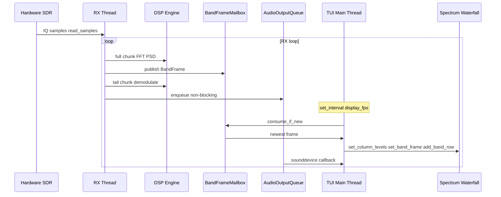

# System architecture — xyz-sdr

Internal architecture, data flow, and concurrency model.

Index: [README.md](README.md) | Related: [dsp.md](dsp.md), [display.md](display.md), [hardware.md](hardware.md), [installer.md](installer.md)

---

## Structure and data flow

The design separates hardware (SDR), digital signal processing (DSP), and the terminal user interface (TUI).

The RX worker **does not** call `call_from_thread()` for spectrum or waterfall. It publishes into **`BandFrameMailbox`** (`core/band_buffer.py`); the main thread drains the latest frame on a timer (`_flush_display_frames`).

### Display level pipeline

On each display tick, `_flush_display_frames()`:

1. `slice_band_to_viewport()` → `cols[width]` (dB).
2. `_compute_column_levels()` → updates `ColumnLevelTracker` (which tracks history internally) and retrieves `floor[]`, `ceiling[]` (or computes global `compute_auto_levels`).
3. Same levels applied to spectrum and waterfall via `set_column_levels()`.

Details: [display.md](display.md).

---

## Concurrency model

| Thread | Responsibilities |
|--------|------------------|
| **Main (Textual)** | Widgets, keyboard/mouse, viewport state, display timer |
| **RX worker** | `read_samples`, FFT, demod, audio enqueue, recorder IQ |

### BandFrameMailbox coalescing

If the worker outruns `display_fps`, only the **newest** frame is shown — no cross-thread widget updates from the worker.

### Audio path isolation

Demodulated audio uses `AudioOutputQueue` (`core/audio_output.py`):

- Bounded queue (~8 chunks)
- `sounddevice` callback on separate thread
- Drops oldest chunk on overflow; tracks underruns for `--debug`

---

## RX worker internals

Per iteration (`tui/app.py` → `_rx_worker`):

1. Resolve `profile = profile_for_sample_rate(sample_rate)`
2. Compute `fft_size`, `band_cols`, `num_samples`, `audio_iq_samples`
3. `read_samples(num_samples)`
4. **Display:** `average_psd` → `make_band_frame` → mailbox
5. **Audio:** `demodulate(samples[-audio_iq_samples:], profile=profile, fm_state=...)`
6. AGC → squelch → `enqueue`

State reset on RX start: `FmDemodState`, `AudioAgc`.

---

## Startup: re-exec and hardware gate

### `try_reexec_for_soapy()` (`core/python_runtime.py`)

Re-launches process in project `.venv` when current Python lacks Soapy bindings. Preserves `main.py` and all CLI args.

Prefer: `.\scripts\run.ps1 [--flags]`

### `--sim` gate (`main.py`)

| Flag | Behavior |
|------|----------|
| `--sim` | `driver = simulated` |
| *(none)* | `bootstrap_soapy()`; exit 1 if no devices |

Readiness: `setup/env_state.py` — [hardware.md](hardware.md), [installer.md](installer.md).

---

## Viewport state

| Variable | Purpose |
|----------|---------|
| `tuned_frequency` | RF center / demod reference (Hz) |
| `passband_center_hz` | Audible PASS center (Hz) |
| `passband_width_hz` | Audible PASS width (Hz) |
| `viewport_center` | Screen center (Hz) |
| `visible_span` | Zoom span (≤ `sample_rate`) |
| `sample_rate` | IQ capture bandwidth (Hz) |

`_sync_viewport()` keeps timeline, spectrum, and waterfall aligned.

---

## IQ bandwidth changes

See [bandwidth.md](bandwidth.md). `change_bandwidth()`:

1. Validate rate
2. Stop RX, wait for worker
3. `set_sample_rate()`
4. Rebuild zoom spans (tuned freq unchanged)
5. Persist TOML, resume RX
6. Log preset hints (WBFM @ 250 kHz, recommended modes)

---

## DSP integration

| Module | Role |
|--------|------|
| `core/dsp.py` | FFT, demod, filters, resamplers, squelch |
| `core/dsp_profiles.py` | Per-preset SR_demod, chunk scale |
| `core/passband.py` | PASS limits and UI mapping |

Full reference: [dsp.md](dsp.md).

---

## Adaptive display DSP

`compute_effective_fft_size()` and `compute_effective_band_cols()` scale with zoom. At narrow spans, FFT grows up to 65k — tune `config/defaults.toml` if CPU/USB limits hit on real hardware.

Per-column display AGC, thermal palette, speed bar: [display.md](display.md). TOML keys: [configuration.md](configuration.md).

---

## Settings and persistence

| Area | Storage | API |
|------|---------|-----|
| Device (driver, SR, freq, gain) | TOML `[device]` | `patch_device_section` |
| DSP (PASS, squelch, FM) | TOML `[dsp]` | `patch_dsp_section` |
| Display (auto-level, waterfall) | TOML `[display]` | `patch_display_section` |

Display algorithm: [display.md](display.md). Full key list: [configuration.md](configuration.md).

Settings UI: Esc → modal (`tui/widgets/settings_menu.py`).

---

## Installer architecture

Express wizard modules under `setup/` — see [installer.md](installer.md).

Environment probe shared between installer and `check_env.py`.
