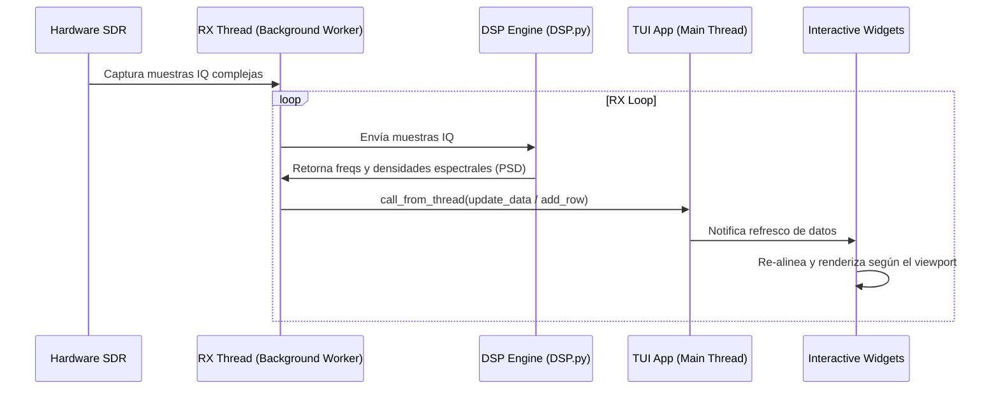

# 🏛️ Arquitectura del Sistema — xyz-sdr

Este documento describe la arquitectura interna, el flujo de datos y el modelo de concurrencia de la aplicación `xyz-sdr`.

---

## 🏗️ Estructura y Flujo de Datos

El diseño sigue una separación clara entre el hardware (SDR), el procesamiento digital de señales (DSP) y la interfaz de usuario en terminal (TUI).



---

## 🧵 Modelo de Concurrencia (Threading Model)

Para asegurar que la interfaz de usuario en terminal se mantenga fluida (60 FPS) y libre de bloqueos de renderizado, `xyz-sdr` utiliza dos hilos de ejecución diferenciados:

1. **Hilo Principal (Main Thread)**:
   * Gestiona el bucle de eventos de Textual.
   * Renderiza los widgets en pantalla.
   * Procesa la entrada de teclado y ratón.
   * Mantiene el estado del viewport de visualización.
2. **Hilo de Recepción (Background RX Worker)**:
   * Se ejecuta en un hilo separado de Python mediante el decorador `@work(thread=True)`.
   * Realiza lecturas síncronas bloqueantes sobre el hardware mediante `SDRDevice.read_samples()`.
   * Calcula la transformada de Fourier (FFT) y la densidad espectral de potencia (PSD) mediante funciones NumPy/SciPy.
   * Distribuye los resultados a los widgets de la interfaz usando el método seguro `call_from_thread()`.

---

## 🔄 Sincronización de Estado y Viewport

La aplicación mantiene un **estado centralizado** en la clase principal `XyzSDRApp` para controlar qué parte del espectro es visible y qué frecuencia se está escuchando:

| Variable | Tipo | Propósito |
| :--- | :--- | :--- |
| `tuned_frequency` | `float` | Frecuencia absoluta demodulada por el dispositivo en Hz. |
| `viewport_center` | `float` | Frecuencia absoluta en Hz correspondiente al centro de la pantalla. |
| `visible_span` | `float` | Ancho de banda visible en pantalla (zoom). Máximo = `sample_rate` actual. |
| `sample_rate` | `float` | Bandwidth IQ de captura del SDR (Hz). Configurable desde el selector **BANDWIDTH**. |
| `scroll_step` | `float` | Cantidad de Hz que varía la frecuencia con cada pulsación de `←` o `→`. |

### Flujo de Sincronización (`_sync_viewport`)
Cuando el usuario interactúa (por ejemplo, hace scroll a la izquierda o zoom-in), el hilo principal modifica `viewport_center` o `visible_span` e invoca `_sync_viewport()`. Este método actualiza las propiedades reactivas en cascada para cada uno de los tres widgets visuales:
```python
def _sync_viewport(self) -> None:
    # 1. Actualiza la regla de frecuencias superior
    timeline = self.query_one("#timeline", FrequencyTimeline)
    timeline.viewport_center_hz = self.viewport_center
    timeline.visible_span_hz = self.visible_span
    timeline.tuned_freq_hz = self.tuned_frequency

    # 2. Sincroniza el gráfico FFT
    spectrum = self.query_one("#spectrum", SpectrumGraph)
    spectrum.set_viewport(self.viewport_center, self.visible_span)

    # 3. Sincroniza el historial de la cascada
    waterfall = self.query_one("#waterfall", WaterfallTimeline)
    waterfall.set_viewport(self.viewport_center, self.visible_span)
```
Esto asegura que las tres representaciones visuales estén alineadas píxel a píxel a lo largo del mismo eje de frecuencia horizontal de forma instantánea.

---

## 📡 Cambio de Bandwidth IQ

Ver documentación detallada: [bandwidth.md](bandwidth.md).

Resumen del flujo en `change_bandwidth()`:

1. Validar rate soportado (`SDRDevice.is_sample_rate_supported`).
2. Detener RX y esperar al worker (`_rx_stop_event`).
3. Aplicar `set_sample_rate()` en hardware.
4. Regenerar niveles de zoom (`build_visible_spans`) y adaptar viewport sin mover la sintonía.
5. Persistir en TOML vía `config_store.patch_device_section`.
6. Reanudar RX si estaba activo.

Los niveles de zoom ya no son fijos: dependen del `sample_rate` activo (100 kHz … sample_rate).

