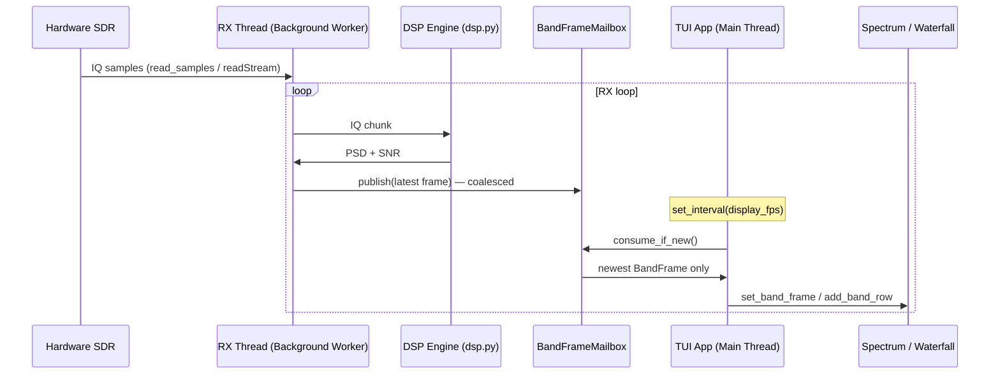

# System architecture — xyz-sdr

This document describes the internal architecture, data flow, and concurrency model of the xyz-sdr application.

---

## Structure and data flow

The design separates hardware (SDR), digital signal processing (DSP), and the terminal user interface (TUI).



The RX worker **does not** call `call_from_thread()` for spectrum or waterfall updates. It publishes into a **`BandFrameMailbox`** (`core/band_buffer.py`); the main thread drains the latest frame on a timer (`_flush_display_frames` in `tui/app.py`).

---

## Concurrency model

Two execution contexts keep the TUI responsive:

1. **Main thread (Textual event loop)**
   - Renders widgets and handles keyboard/mouse.
   - Owns viewport state (`viewport_center`, `visible_span`, etc.).
   - Periodically calls `_flush_display_frames()` at `display_fps` from config.
2. **Background RX worker** (`@work(thread=True)`, `_rx_worker`)
   - Blocking reads via `SDRDevice.read_samples()`.
   - FFT / PSD averaging (`average_psd`), SNR estimation, band projection (`make_band_frame`).
   - Publishes to `BandFrameMailbox` (drops intermediate frames if the UI is slow).
   - Demodulates audio and **non-blocking** enqueues to `AudioOutputQueue` (see [audio.md](audio.md)).

### BandFrameMailbox coalescing

```python
# Worker (RX thread)
frame = make_band_frame(psd, center_freq, sample_rate, band_cols=band_cols)
self._band_mailbox.publish(frame, snr)

# Main thread (timer callback)
frame, snr, seq = self._band_mailbox.consume_if_new(self._display_sequence)
if frame is not None:
    spectrum.set_band_frame(frame)
    waterfall.add_band_row(frame)
```

If the worker runs faster than `display_fps`, only the **most recent** frame is applied — avoiding Textual cross-thread calls and reducing UI backlog.

---

## Startup: re-exec and hardware gate

### `try_reexec_for_soapy()` (`core/python_runtime.py`)

On entry, `main.py` calls `try_reexec_for_soapy()` unless `XYZ_SDR_REEXEC_DONE` is set. When the current interpreter is not the project `.venv` or a Soapy-compatible Python, the process **re-launches** itself with the correct executable, preserving **`main.py` and all CLI arguments** (fixed in commit `e9da33e`).

Always prefer:

```powershell
.\scripts\run.ps1 [--flags]
```

over bare `python main.py` from an arbitrary shell.

### `--sim` gate (`main.py`)

| Flag | Behavior |
|------|----------|
| `--sim` | `driver = "simulated"`; no hardware check |
| *(none)* | `bootstrap_soapy()`; exit 1 if import fails or `has_devices` is false |

The installer wizard may add `--sim` automatically when launching without hardware; **`scripts/run.ps1` does not.**

Readiness properties live in `setup/env_state.py`: `env_ready` (sim-capable) vs `hardware_ready` (real RX). See [hardware.md](hardware.md).

---

## Centralized viewport state

`XyzSDRApp` holds shared tuning and zoom state:

| Variable | Purpose |
|----------|---------|
| `tuned_frequency` | Absolute demod frequency (Hz) |
| `viewport_center` | Screen center frequency (Hz) |
| `visible_span` | Visible bandwidth / zoom (≤ `sample_rate`) |
| `sample_rate` | IQ capture bandwidth (Hz) |
| `scroll_step` | Hz per `←` / `→` key press |

`_sync_viewport()` propagates these values to `FrequencyTimeline`, `SpectrumGraph`, and `WaterfallTimeline` so all three layers stay aligned.

---

## IQ bandwidth changes

See [bandwidth.md](bandwidth.md). Summary of `change_bandwidth()`:

1. Validate rate (`SDRDevice.is_sample_rate_supported`).
2. Stop RX and wait for the worker (`_rx_stop_event`).
3. Apply `set_sample_rate()` on hardware.
4. Rebuild zoom levels (`build_visible_spans`) without moving tuned frequency.
5. Persist via `config_store.patch_device_section`.
6. Resume RX if it was active.

Zoom levels are derived from the active `sample_rate`, not fixed presets.

---

## Adaptive DSP at zoom

`compute_effective_fft_size()` and `compute_effective_band_cols()` (`core/dsp.py`) scale FFT size and band cache columns when the visible span narrows. This applies equally in simulation and on hardware; real devices add USB/CPU load at high zoom. Tune `config/defaults.toml` if needed ([hardware.md](hardware.md)).
