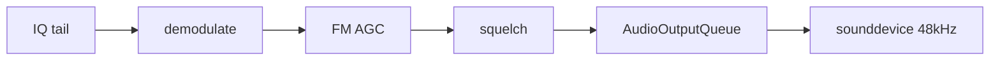

# Audio — xyz-sdr

Demodulated RF audio (real-time listening) and UI sound effects (DDS). These are **separate** audio paths.

Index: [README.md](README.md) | DSP detail: [dsp.md](dsp.md) | Config: [configuration.md](configuration.md)

---

## Demodulated audio (RX)

When reception is active (`S` / **INICIAR RX**), the RX worker:

1. Reads IQ from `SDRDevice.read_samples()` (SoapySDR or `SimulatedSDR` with `--sim`).
2. Uses **tail IQ** for demod (`samples[-audio_iq_samples:]`) — see [architecture.md](architecture.md).
3. Calls `core/dsp.demodulate()` with PASS width, de-emphasis, profile, and `FmDemodState`.
4. Applies **FM AGC** (`fm_agc_enabled`) for `wbfm` / `nbfm`.
5. Applies squelch (optional).
6. Enqueues via **`AudioOutputQueue`** at `dsp.audio_rate` (default 48 kHz).



### High IQ bandwidth (4–8 MHz)

Capture rate affects **spectrum width**, not demod IQ rate. Internal chain:

- `resample_iq_for_demod()` → ~560–768 kHz
- Adaptive FIR → discriminator → `resample_audio_to_rate()` → exact 48 kHz

Details: [bandwidth.md](bandwidth.md), [audio-presets-research.md](audio-presets-research.md).

### Output queue

`AudioOutputQueue` (`core/audio_output.py`):

| Property | Value |
|----------|-------|
| Queue depth | ~8 chunks |
| Block size | 1024 frames |
| Overflow | Drop oldest chunk (`dropped_chunks`) |
| Underflow | Silence + `underrun_count` |
| Volume | User 0–100% (`V`), applied in callback |

If stutter occurs: lower FFT/display load ([hardware.md](hardware.md)) or reduce IQ preset.

---

## FM audio settings

**Esc → Audio FM / Noise**

| Setting | TOML key | Default | Notes |
|---------|----------|---------|-------|
| De-emphasis | `fm_deemphasis_us` | `50` | 50 µs EU / 75 µs US |
| FM AGC | `fm_agc_enabled` | `true` | WBFM/NBFM post-demod |
| Squelch | `squelch_enabled` | `false` | SNR threshold mute |
| Squelch threshold | `squelch_threshold` | `15` | dB (UI scale) |
| Volume | `volume` | `75` | Output % |
| Audio rate | `audio_rate` | `48000` | Must match `AudioOutputQueue` |

De-emphasis uses IIR with chunk-to-chunk state (`FmDemodState.deemph_zi`).

---

## Normalization and loudness chain

1. Demod peak normalize → `NORMALIZE_LEVEL` (0.35) in `core/dsp.py`
2. FM AGC (optional) — slow level tracking between stations
3. Squelch — zeroes audio when SNR low
4. User volume in audio callback

---

## Debug metrics (`--debug`)

Log panel every ~3 s with RX active:

```
[DEBUG] perf 3.0s | RX 12.0 iter/s proc 8.2ms p95 15.1ms | UI 18.0 fps ... |
iq 131072 smp 64ms | demod 2.1ms | audio 960 smp/iter | audio u/d 0/0
```

| Field | Meaning |
|-------|---------|
| `iq N smp` | Average IQ chunk size |
| `64ms` | Chunk duration at current SR |
| `demod Xms` | Demodulation time |
| `audio N smp/iter` | Samples enqueued per RX iter |
| `u/d` | Underruns / dropped chunks |

---

## UI sound-effects engine

`AudioEffects` (`core/audio_effects.py`) — DDS at **44100 Hz**, not related to demod path.

| Sound | Use |
|-------|-----|
| Click | Tuning scroll (disabled during continuous scroll) |
| Blip | Buttons, selects, mode buttons |
| Chime | Settings applied |
| Error | Invalid frequency |
| Startup | After mount |

Toggle: Esc → **Efectos Sonido**.

Characteristics: non-blocking `sd.play`, fail-silent on missing hardware.

---

## Mode coverage

| Mode | Audio | Notes |
|------|-------|-------|
| wbfm | Yes | Full PASS + de-emphasis + AGC |
| nbfm | Yes | Full PASS + de-emphasis + AGC |
| am | Yes | Envelope + PASS |
| usb / lsb | Yes | PASS + offset; use 250–500 kHz IQ for HF |
| cw, dsb, raw, auto | No | UI only — no demod route |

---

## Related tests

- `resources/test/test_audio_agc.py`
- `resources/test/test_bandwidth_presets.py`
- `resources/test/test_squelch.py`
