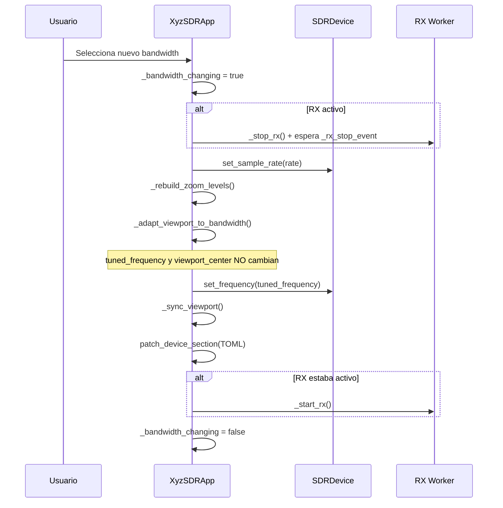

# 📡 Bandwidth IQ (Sample Rate) — xyz-sdr

En xyz-sdr, el **bandwidth de captura** es el `sample_rate` del SDR: define cuánto espectro IQ recibe el dispositivo alrededor de la frecuencia central.

---

## Interfaz de usuario

- **Selector BANDWIDTH** en el panel izquierdo, debajo del campo de frecuencia (MHz).
- **Atajo `B`**: enfoca el desplegable de bandwidth.
- **Barra de estado**: métrica `BW` (bandwidth activo) junto a `ZOOM` (span visible en pantalla).

> **ZOOM ≠ BW**: el zoom controla cuánto espectro *ves* en pantalla; el bandwidth controla cuánto espectro *captura* el hardware. El zoom máximo está acotado al bandwidth actual.

---

## Presets disponibles

Definidos en `core/device.py` → `BANDWIDTH_PRESETS`:

| Preset | Uso típico |
|--------|------------|
| 250 kHz | NFM, señales estrechas |
| 500 kHz | AM, scanning fino |
| 1 MHz | FM local |
| 2.048 MHz | WBFM, default RSP1 |
| 4 MHz | Exploración amplia |
| 8 MHz | Máximo (según driver) |

SoapySDR filtra los presets según el rango soportado por el hardware. En **modo simulado** están todos disponibles.

---

## Secuencia al cambiar bandwidth



### Regla de adaptación de zoom

```
Si visible_span > sample_rate:
    visible_span = sample_rate   (zoom-out máximo)
    viewport_center → sin cambios
Si visible_span <= sample_rate:
    mantener visible_span (recalcular zoom_index)
```

---

## Configuración persistente

Archivo: `config/defaults.toml` → sección `[device]`:

```toml
[device]
driver       = "sdrplay"
sample_rate  = 2_048_000      # Bandwidth IQ en Hz
center_freq  = 100_600_000
gain         = 40.0
```

La persistencia la gestiona `core/config_store.py` (`patch_device_section`). Se actualiza al cambiar bandwidth o driver con éxito.

Al arrancar, si `sample_rate` del TOML difiere del default del dispositivo y es soportado, se aplica automáticamente.

---

## Cambio de driver (Esc → Hardware)

`change_device_driver()` en `tui/app.py`:

- Detiene RX, cierra el dispositivo, abre el nuevo driver.
- Si falla (p. ej. SDRplay sin SoapySDR): **rollback** al driver anterior, log de error, **sin crash**.
- Devuelve `bool`; el menú de ajustes re-sincroniza el Select.

---

## Archivos relevantes

| Archivo | Responsabilidad |
|---------|-----------------|
| `core/device.py` | `set_sample_rate()`, `get_supported_sample_rates()` |
| `core/dsp.py` | `compute_rx_chunk_samples()` — lectura IQ escalada |
| `core/config_store.py` | Persistencia TOML |
| `tui/app.py` | `change_bandwidth()`, zoom dinámico, worker RX |
| `tui/widgets/settings_menu.py` | Cambio de driver con rollback |

---

## Worker RX y cambios en caliente

- El worker captura un **snapshot** de `sample_rate`, frecuencia y modo por iteración.
- `_rx_stop_event` sincroniza parada/arranque durante cambios de bandwidth o driver.
- Errores transitorios durante `_bandwidth_changing` se ignoran sin tumbar la TUI.
