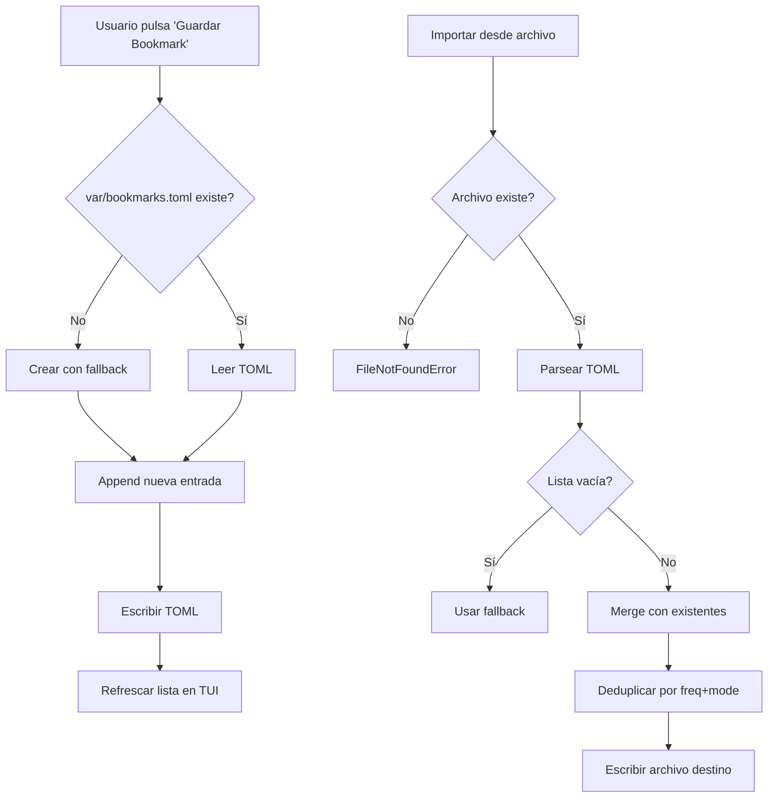

# Bookmarks — xyz-sdr

Sistema de favoritos de frecuencia: guarda nombres, frecuencias y modos de demodulación para volver a ellos con un clic. Persistencia en TOML, con export/import entre máquinas.

> **Módulo:** `core/bookmarks.py` (92 líneas)
> **Persistencia:** `var/bookmarks.toml`
> **Tests:** `resources/test/test_bookmarks.py`

---

## Formato del archivo

`var/bookmarks.toml` usa una lista de tablas TOML:

```toml
# xyz-sdr | bookmarks — favoritos de frecuencia

[[bookmarks]]
name = "Radio Nacional"
freq_hz = 88400000
mode = "wbfm"

[[bookmarks]]
name = "Torre de control LEBL"
freq_hz = 121700000
mode = "am"

[[bookmarks]]
name = "PMR446 canal 1"
freq_hz = 446006250
mode = "nbfm"
```

### Campos

| Campo | Tipo | Obligatorio | Default | Descripción |
|-------|------|-------------|---------|-------------|
| `name` | string | no | `"Favorito"` | Etiqueta legible |
| `freq_hz` | float | sí | — | Frecuencia central en Hz |
| `mode` | string | no | `"wbfm"` | Modo demod: `wbfm`, `nbfm`, `am`, `usb`, `lsb`, `cw`, `dsb`, `raw` |

> **Decisión:** `freq_hz` se persiste como entero (`int(freq)`) para legibilidad. No se pierde precisión porque las frecuencias operativas no usan decimales.

---

## API Python

`core/bookmarks.py` exporta las siguientes funciones:

### Constantes y tipos

```python
Bookmark = tuple[str, float, str]  # (name, freq_hz, mode)
```

### Carga y persistencia

```python
from core.bookmarks import load_bookmarks, save_bookmarks

# Si el archivo no existe, lo crea con fallback.
bookmarks: list[Bookmark] = load_bookmarks(path, fallback=[("Casa", 88.0e6, "wbfm")])

# Persistir (sobrescribe el archivo).
save_bookmarks(path, bookmarks)
```

### Parsing y serialización

```python
from core.bookmarks import parse_bookmarks_data

# Convierte un dict (e.g. cargado con tomllib) en lista de Bookmark.
bookmarks = parse_bookmarks_data(data)
```

### Export / import

```python
from core.bookmarks import export_bookmarks, import_bookmarks, merge_bookmarks

# Exportar a otro archivo (formato idéntico al interno).
export_bookmarks(bookmarks, Path("otro_archivo.toml"))

# Importar desde archivo. Lanza FileNotFoundError si no existe.
imported = import_bookmarks(src_path, fallback=[])

# Fusionar dos listas deduplicando por (freq_hz ±1 Hz, mode).
merged = merge_bookmarks(existing, imported)
```

---

## Uso desde la TUI

> **Estado actual:** el botón **Guardar Bookmark** en el sidebar guarda el `tuned_frequency` y `mode` actuales con nombre autogenerado (`"Bookmark N"`).

Lee `tui/app.py` (acciones `action_add_bookmark` y familia) y `tui/widgets/settings_menu.py` (UI de import/export) para los detalles exactos.

### Flujo básico

```
[Sidebar]  [Guardar Bookmark]
            ↓
   Crea entrada en var/bookmarks.toml
   con (tuned_frequency, mode, name="Bookmark N")
            ↓
   Se recarga automáticamente al cambiar de banda
   o al iniciar la app.
```

### Persistencia entre sesiones

El archivo `var/bookmarks.toml` está fuera de `git` (cubierto por `var/` en `.gitignore`). Es local a cada instalación.

---

## Diagrama de flujo



---

## Gaps reconocidos

Estos son puntos donde la implementación actual no llega, marcados para iteraciones futuras:

1. **Sin UI para renombrar bookmarks.** El nombre se autogenera como `"Bookmark N"`. Edición manual del archivo o implementación futura.
2. **Sin búsqueda/filtrado por nombre.** La lista se muestra entera; sin typeahead.
3. **Sin categorías/tags.** Todos los bookmarks viven en un solo plano; no hay jerarquía ni grupos.
4. **Sin export a CSV/JSON.** Solo TOML (formato interno). Export a CSV facilitaría hojas de cálculo; a JSON facilitaría API.
5. **Sin share en red.** No hay sync entre máquinas (e.g. via remote URL).
6. **Sin integración con el scanner.** El scanner detecta señales pero no las guarda como bookmarks.
7. **Sin hotkey dedicado.** Solo accesible vía botón; no hay `Ctrl+B` o similar.
8. **`import_bookmarks` no pide confirmación** si va a sobrescribir — usa `merge_bookmarks` para acumular.

---

## Cómo verificar

```powershell
# Test unitario (debe pasar)
python -m pytest resources/test/test_bookmarks.py -v

# Inspeccionar archivo generado
Get-Content .\var\bookmarks.toml
```

---

## Ver también

- [`recorder.md`](recorder.md) — otro sistema de persistencia local
- [`scanner.md`](scanner.md) — detecta señales; integración futura con bookmarks
- [`configuration.md`](configuration.md) — otras claves TOML persistentes
- [`roadmap.md`](roadmap.md) — fase donde se cerrarán los gaps reconocidos