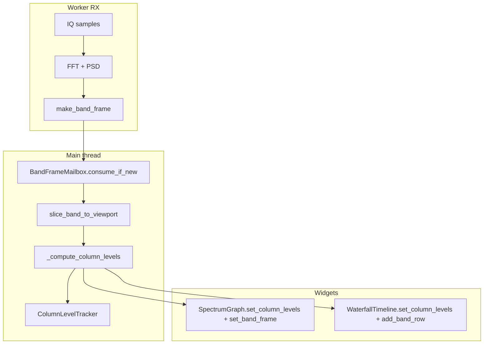

# Visualización — espectro, cascada y niveles dB

Este documento describe el **pipeline de visualización** compartido entre espectro y waterfall: paleta térmica, auto-level por frecuencia, alineación de columnas y barra de velocidad.

Índice: [README.md](README.md) | Widgets: [widgets.md](widgets.md) | Arquitectura: [architecture.md](architecture.md)

---

## Layout en pantalla

El panel derecho (`#display_area`) apila los componentes en este orden:

```
FrequencyTimeline      ← regla de frecuencias (3 filas)
SpectrumGraph          ← FFT en tiempo real
#waterfall_speed_row   ← botones 1 2 3 5 10 25 50 (FPS cascada)
WaterfallTimeline      ← espectrograma (100% ancho espectral)
Log                    ← panel de mensajes
```

La barra de velocidad **ya no** usa `dock: right`; espectro y cascada comparten el mismo ancho de columnas (`plot_content_width`).

---

## Pipeline de datos (cada frame visual)



1. El worker RX publica un `BandFrame` en `BandFrameMailbox` (coalescing: solo el más reciente).
2. En el timer `_flush_display_frames()` (frecuencia `dsp.display_fps`), la app hace `slice_band_to_viewport()` → vector `cols[width]` en dB para el viewport actual.
3. Se calculan `floor[width]` y `ceiling[width]` (ver sección Auto-level).
4. Espectro y waterfall reciben los **mismos** arrays vía `set_column_levels()`.
5. El waterfall añade una fila con `add_band_row()` (throttle según FPS elegido).

---

## Paleta térmica compartida

Archivo: `tui/widgets/display_palette.py`

| Función | Rol |
|---------|-----|
| `THERMAL_GRADIENT` | 32 paradas de color (negro → azul → cian → verde → amarillo → rojo → blanco) |
| `gradient_color(norm)` | `norm ∈ [0,1]` → color hex interpolado |
| `cell_background(norm, in_band=…)` | Color de celda; fuera de PASS se atenúa mezclando con `#0a0a12` |
| `normalize_per_column(cols, floor, ceiling)` | Normalización por columna a `[0,1]` |
| `compute_auto_levels(values, …)` | Un solo min/max global (modo `global`) |
| `plot_content_width(widget)` | Ancho útil del widget para mapeo frecuencia→columna |

Espectro y cascada usan **idéntica** normalización y gradiente para que un pico y su traza temporal coincidan en color y posición horizontal.

---

## Auto-level de paleta

Interruptor maestro: `display.waterfall_auto_level` (TOML) o **Ajustes → Waterfall auto** (persiste en TOML vía `config_store.patch_display_section`).

| `waterfall_auto_level` | Comportamiento |
|------------------------|----------------|
| `true` | Rango dB dinámico según `display_level_mode` |
| `false` | Rango fijo `-80` / `-20` dB en todas las columnas |

### Modo `per_column` (recomendado)

Clase: `core/display_levels.py` → `ColumnLevelTracker`

Cada columna de frecuencia tiene su propio suelo y techo. Compensa **pendientes de ruido** izquierda→derecha (filtros del receptor, DC, más ruido en HF/LF).

**Entradas por frame:**

- `cols` — slice actual del espectro (frame RX), ingresado al tracker con `push_viewport_row(cols)`.
- Historial interno — almacenado en el tracker en `_row_history` (que mantiene hasta `column_history_rows` filas del historial de viewport).

**Algoritmo (vectorizado NumPy):**

1. Apilar `cols` + historial → percentiles por columna (`column_floor_pct`, `column_ceiling_pct`).
2. Acotar: suelo ≤ valor actual; techo ≥ valor actual (por columna válida).
3. `ceiling = max(ceiling, floor + min_range_efectivo)`.
4. EMA asimétrica:
   - **Suelo**: baja rápido (`column_ema_attack`), sube lento (`column_ema_release`).
   - **Techo**: sube rápido, baja lento.
5. Suavizado lateral 1D (`column_smooth_bins`, media móvil con padding `edge`).

**Rango mínimo con zoom:**

```text
span_ratio = visible_span / sample_rate   # 0 … 1
min_range_efectivo = waterfall_min_range_db × (0.5 + 0.5 × span_ratio)
```

A zoom amplio el rango mínimo crece ligeramente para evitar una pantalla “plana”.

**Reconfiguración del tracker:**

| Evento | Acción |
|--------|--------|
| Cambio de ancho de terminal | `_level_tracker.reconfigure(width)` en `_update_display_width()` |
| Cambio de `visible_span` (zoom) | `reconfigure(width, reset=True)` + `set_span_ratio()` en `_apply_display_viewport()` |

### Modo `global`

Un solo par `(level_min, level_max)` con `compute_auto_levels()` sobre todo `cols`; se replica en arrays constantes para todas las columnas.

Percentiles: `waterfall_level_low_pct` / `waterfall_level_high_pct` (por defecto 5 / 99).

---

## API de widgets

### `SpectrumGraph`

```python
spectrum.set_column_levels(floors: np.ndarray, ceilings: np.ndarray)
spectrum.set_level_range(lo, hi)  # wrapper → arrays constantes
spectrum.set_frequency_columns(width)
spectrum.set_band_frame(frame)
```

Render: barras ASCII `▁▂▃▄▅▆▇█` + contorno `·`; normalización vía `normalize_per_column`.

### `WaterfallTimeline`

```python
waterfall.set_column_levels(floors, ceilings)
waterfall.get_level_history(max_rows=None)  # compatibilidad (ya no se usa para auto-level)
waterfall.add_band_row(frame)
```

- Filas nuevas se insertan **arriba** (top-down); hueco inferior hasta llenar altura.
- `_levels_from_app`: cuando la app envía niveles, el widget **no** sobrescribe con su `_update_normalization()` interno.
- Caché de render invalida por hash de `floors.tobytes()` / `ceilings.tobytes()`.

---

## Barra de velocidad

| Botón | FPS de nueva fila en cascada |
|-------|------------------------------|
| 1 | 1 |
| 2 | 2 |
| 3 | 3 |
| 5 | 5 |
| 10 | 10 (valor inicial al arrancar) |
| 25 | 25 |
| 50 | 50 |

Implementación: `waterfall.waterfall_speed` limita `add_band_row()` con `interval = 1.0 / speed`. El botón activo lleva clase CSS `active-spd` (borde verde).

Atajo de historial: **Shift + rueda** en la cascada desplaza el offset vertical del historial (`scroll_history`).

---

## Configuración `[display]`

Referencia completa: [configuration.md](configuration.md).

```toml
[display]
waterfall_auto_level = true
display_level_mode = "per_column"   # "global" | "per_column"
waterfall_level_low_pct = 5
waterfall_level_high_pct = 99
waterfall_min_range_db = 6.0
column_floor_pct = 10
column_ceiling_pct = 99
column_ema_attack = 0.35
column_ema_release = 0.08
column_smooth_bins = 3
column_history_rows = 32
waterfall_history = 100
waterfall_history_buffer_ratio = 0.667
display_fps = 20   # en [dsp]; tope de _flush_display_frames
```

---

## Archivos relevantes

| Archivo | Responsabilidad |
|---------|-----------------|
| `core/display_levels.py` | `ColumnLevelTracker` |
| `tui/widgets/display_palette.py` | Gradiente, normalización, `plot_content_width` |
| `tui/app.py` | `_flush_display_frames`, `_compute_column_levels`, layout CSS |
| `tui/widgets/spectrum_graph.py` | Render espectro + `set_column_levels` |
| `tui/widgets/waterfall_timeline.py` | Cascada, renderizado RLE, throttle FPS |
| `core/band_buffer.py` | `slice_band_to_viewport`, `BandFrame` |
| `resources/test/test_display_levels.py` | Tests del tracker |
| `resources/test/test_waterfall_history.py` | Tests cascada e historial |

---

## Cuándo usar cada modo

| Escenario | Modo recomendado |
|-----------|------------------|
| Banda ancha, ruido con pendiente HF/LF | `per_column` |
| Zoom cerrado en una señal, ruido uniforme | `global` |
| Comparación absoluta de potencia entre frecuencias | `waterfall_auto_level = false` (rango fijo) |
| Grabación / análisis offline | Desactivar auto; fijar niveles manualmente en TOML o código |
