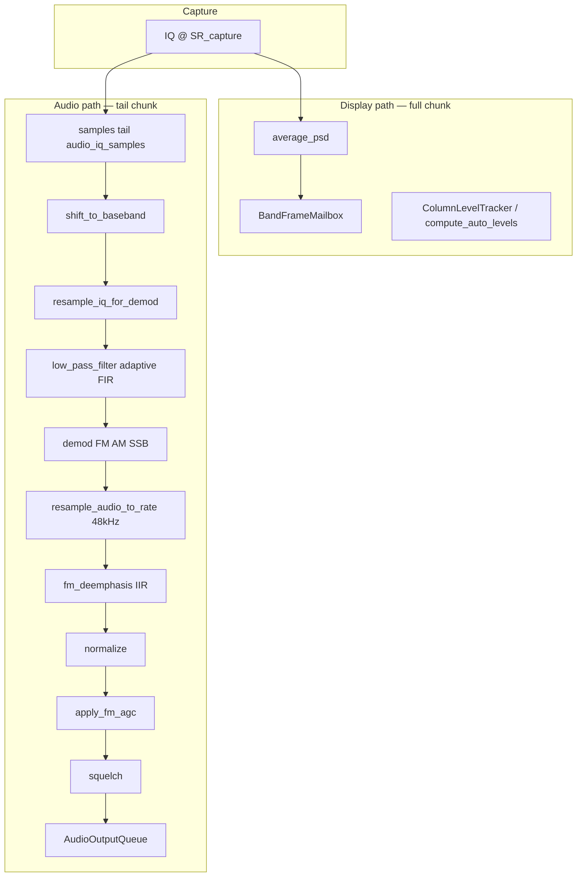

# Digital signal processing — xyz-sdr

Reference for `core/dsp.py`, `core/dsp_profiles.py`, and how IQ becomes audio.

Index: [README.md](README.md) | [audio.md](audio.md) | [bandwidth.md](bandwidth.md) | [passband.md](passband.md) | [configuration.md](configuration.md)

---

## Pipeline overview

The RX worker reads one IQ block per iteration. **Spectrum** uses the full block; **audio** uses the trailing `audio_iq_samples` to reduce latency on low presets (250–500 kHz).

---

## Preset profiles

`core/dsp_profiles.py` maps each IQ preset to DSP parameters:

| Preset | iq_demod_max | iq_demod_min | chunk_scale | fft_avg cap | Modes |
|--------|--------------|--------------|-------------|-------------|-------|
| 250 kHz | 160 kHz | 80 kHz | 0.25 | 8 | nbfm, am, usb, lsb |
| 500 kHz | 250 kHz | 100 kHz | 0.5 | 8 | am, nbfm, usb, lsb |
| 1 MHz | 560 kHz | 250 kHz | 0.75 | 8 | wbfm, nbfm, am |
| 2.048 MHz | 560 kHz | 250 kHz | 1.0 | — | wbfm (reference) |
| 4 MHz | 768 kHz | 250 kHz | 1.0 | 4 | wbfm, spectrum |
| 8 MHz | 768 kHz | 250 kHz | 1.0 | 4 | wbfm, max span |

API:

- `profile_for_sample_rate(capture_rate)` — nearest preset profile
- `compute_target_demod_rate(passband, profile)` — IQ rate before demod
- `effective_fft_avg(num_avg, profile)` — cap FFT averaging at high SR

---

## Resampling

### IQ: `resample_iq_for_demod()`

Decimates complex IQ before filtering when `SR_capture` exceeds what the PASS band needs. Prevents wideband noise from degrading FM at 4–8 MHz presets.

Parameters from profile: `oversample`, `min_rate`, `max_rate`, `target_rate`.

### Audio: `resample_audio_to_rate()`

After demodulation, converts to **exact** `dsp.audio_rate` (default 48 000 Hz) using `scipy.signal.resample_poly` with a rational ratio (`Fraction.limit_denominator(1000)`).

Replaces legacy `int(SR / 48000)` decimation that produced ~50.9 kHz intermediate rates.

---

## Demodulators

| Function | Mode | Notes |
|----------|------|-------|
| `demod_wbfm()` | wbfm | Phase discriminator + de-emphasis |
| `demod_nbfm()` | nbfm | Scaled discriminator, deviation 5 kHz |
| `demod_am()` | am | Envelope detection |
| `demod_ssb()` | usb/lsb | PASS + offset supported; IQ decimation |

Router: `demodulate(mode, ..., passband_width_hz, frequency_offset_hz, fm_state, profile)`.

### FM state: `FmDemodState`

Persists between RX chunks:

- `last_filtered` — complex sample for phase continuity in discriminator
- `deemph_zi` — IIR state for de-emphasis filter

Reset on RX start, mode change, or bandwidth change.

### De-emphasis: `fm_deemphasis()`

Standard IIR: `y[n] = x[n] + alpha * y[n-1]`, `alpha = exp(-1/(fs*tau))`.

Configurable via `fm_deemphasis_us` (50 µs EU, 75 µs US).

---

## Filters

`low_pass_filter()` uses `_adaptive_fir_order()` — more FIR taps when cutoff is small relative to sample rate (critical at high IQ SR before decimation).

---

## Post-demod processing

| Stage | Module | Config |
|-------|--------|--------|
| Normalize | `_normalize_audio()` | Peak → `NORMALIZE_LEVEL` (0.35) |
| FM AGC | `AudioAgc` / `apply_fm_agc()` | `fm_agc_enabled` |
| Squelch | `SquelchGate` | `squelch_enabled`, `squelch_threshold` |
| Output | `AudioOutputQueue` | `audio_rate`, volume 0–100% |

---

## Chunk sizing

| Function | Purpose |
|----------|---------|
| `compute_rx_chunk_samples()` | IQ read size for FFT (scales with SR, profile `chunk_scale`) |
| `compute_audio_chunk_samples()` | Tail size for demod (smaller on low SR) |
| `compute_effective_fft_size()` | Zoom-adaptive FFT |
| `compute_effective_band_cols()` | Zoom-adaptive band cache |

---

## SNR estimation

`estimate_snr_at_freq()` — local bin vs background percentile, excludes PASS guard band.

Used for squelch and status display.

---

## Configuration (`config/defaults.toml` → `[dsp]`)

| Key | Default | Description |
|-----|---------|-------------|
| `fft_size` | 8192 | Base FFT size |
| `fft_avg_windows` | 8 | PSD averaging windows |
| `fft_overlap` | 0.5 | FFT overlap |
| `band_cache_cols` | 1024 | Internal band grid |
| `display_fps` | 20 | UI refresh cap |
| `audio_rate` | 48000 | Audio output rate |
| `demod_mode` | wbfm | Initial mode |
| `wbfm_bandwidth` | 147540 | PASS default WBFM (persisted from UI) |
| `fm_deemphasis_us` | 50 | FM de-emphasis |
| `fm_agc_enabled` | true | Post-demod AGC |
| `squelch_enabled` | false | Squelch gate |

Display-only keys (`display_level_mode`, waterfall auto-level, etc.) live in `[display]` — see [configuration.md](configuration.md) and [display.md](display.md).

---

## Related documentation

| Topic | Document |
|-------|----------|
| Display levels & palette | [display.md](display.md) |
| Full TOML reference | [configuration.md](configuration.md) |
| Architecture / RX worker | [architecture.md](architecture.md) |

---

## Debug (`--debug`)

RX worker logs (every ~3 s):

- RX iter/s, proc ms, p95
- IQ chunk samples + duration ms
- Demod ms, audio samples per iter
- Audio underruns / dropped chunks (`AudioOutputQueue`)

---

## Tests

- `resources/test/test_dsp.py`
- `resources/test/test_bandwidth_presets.py`
- `resources/test/test_audio_agc.py`
