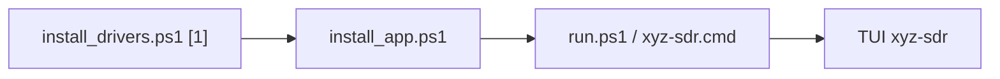

# DX y empaquetado — xyz-sdr

Guía de lanzamiento en Windows, atajos de `run.ps1`, acceso directo en escritorio y perfiles de configuración por banda de servicio.

Índice: [README.md](README.md) | Config: [configuration.md](configuration.md) | Instalador: [installer.md](installer.md)

---

## Flujo recomendado (Windows)



1. **`setup/install_drivers.ps1`** — drivers Soapy, Python `.venv`, dependencias.
2. **`setup/install_app.ps1`** — acceso directo en escritorio (opcional).
3. **`scripts/run.ps1`** o **`scripts/xyz-sdr.cmd`** — arranque diario.

---

## `scripts/run.ps1` — atajos

El script usa parámetros con nombre (PowerShell). Equivalente clásico `--flag` vía `$ExtraArgs`.

| Atajo | Acción |
|-------|--------|
| *(sin args)* | Lanzar TUI con hardware |
| `-Sim` | Modo simulación (`--sim`) |
| `-Debug` | Métricas RX/UI en panel log (`--debug`) |
| `-Check` | Verificar entorno (`--check`) |
| `-ListDev` | Listar dispositivos Soapy |
| `-NoSplash` | Omitir splash de carga |
| `-Band fm_broadcast` | Perfil FM 88–108 MHz |
| `-Band airband` | Aviación VHF |
| `-Band pmr446` | PMR446 UHF |
| `-Band hf_lsb` | HF LSB |
| `-Freq 97.7 -Mode wbfm` | Frecuencia y modo al arrancar |
| `-Driver rtlsdr` | Forzar driver |

```powershell
.\scripts\run.ps1 -Sim -Debug
.\scripts\run.ps1 -Band fm_broadcast
.\scripts\run.ps1 -Band airband -Freq 121.5
.\scripts\run.ps1 -Check
```

Ayuda integrada: `.\scripts\run.ps1 -?`

### `scripts/xyz-sdr.cmd`

Launcher para doble clic (delega en `run.ps1` con `-ExecutionPolicy Bypass`). Útil cuando el acceso directo apunta al `.cmd` en lugar de PowerShell.

---

## Acceso directo — `setup/install_app.ps1`

| Parámetro | Efecto |
|-----------|--------|
| *(default)* | Acceso directo **Escritorio** → `xyz-sdr.lnk` |
| `-StartMenu` | Carpeta `Inicio → Programs\xyz-sdr` |
| `-SimShortcut` | Añade `xyz-sdr (sim).lnk` con `-Sim` |
| `-Uninstall` | Elimina accesos directos creados |
| `-Quiet` | Sin mensajes informativos |

```powershell
.\setup\install_app.ps1
.\setup\install_app.ps1 -StartMenu -SimShortcut
.\setup\install_app.ps1 -Uninstall
```

Cada acceso directo ejecuta:

```text
powershell.exe -NoProfile -ExecutionPolicy Bypass -File "<repo>\scripts\run.ps1"
```

**Limitación conocida:** no genera instalador MSI/EXE; es un atajo al repositorio clonado. Para distribución empaquetada haría falta un instalador externo (Inno Setup, WiX) que copie el repo y ejecute `install_drivers.ps1`.

---

## Perfiles por banda (`config/bands/`)

Archivos TOML parciales con las mismas secciones que `defaults.toml`. Se **fusionan** sobre defaults al arrancar o al elegir perfil en la TUI.

| ID | Banda | IQ típico | Modo |
|----|-------|-----------|------|
| `fm_broadcast` | FM 88–108 MHz | 2.048 MHz | WBFM |
| `airband` | Aviación 118–137 MHz | 250 kHz | NBFM + squelch |
| `pmr446` | PMR446 446 MHz | 500 kHz | NBFM |
| `hf_lsb` | HF <10 MHz | 250 kHz | LSB |

### Persistencia

Al aplicar un perfil (TUI **BANDA** o CLI `--band`):

1. Se fusiona en memoria para la sesión.
2. Se escriben claves relevantes en `config/defaults.toml` vía `persist_band_profile()`.
3. Se guarda `[app] active_band_profile = "<id>"` para el próximo arranque.

```powershell
# Arranque con perfil (también persiste active_band_profile)
.\scripts\run.ps1 -Band fm_broadcast

# Próximo arranque sin -Band: lee active_band_profile del TOML
.\scripts\run.ps1
```

Crear perfil propio: copiar un `.toml` en `config/bands/` con bloque `[meta]` opcional (`label`, `description`).

---

## Dependencias opcionales

| Archivo | Contenido |
|---------|-----------|
| `requirements.txt` | Runtime base (Soapy, TUI, DSP) |
| `requirements-dev.txt` | pytest, pytest-cov |
| `requirements-ai.txt` | faster-whisper, scikit-learn (opcional) |

```powershell
pip install -r requirements-ai.txt
```

---

## Scripts Unix

| Script | Rol |
|--------|-----|
| `scripts/run.sh` | Ejecutar app (`.venv/bin/python`) |
| `scripts/test.sh` | pytest |

Los perfiles `-Band` están disponibles vía `main.py --band` en cualquier plataforma.

---

## Mapa de archivos

| Archivo | Rol |
|---------|------|
| `scripts/run.ps1` | Launcher Windows con atajos |
| `scripts/xyz-sdr.cmd` | Doble clic |
| `setup/install_app.ps1` | Acceso directo escritorio/menú |
| `core/band_profiles.py` | Carga y fusión de perfiles |
| `core/config_store.py` | `persist_band_profile()` |
| `config/bands/*.toml` | Perfiles por banda |
