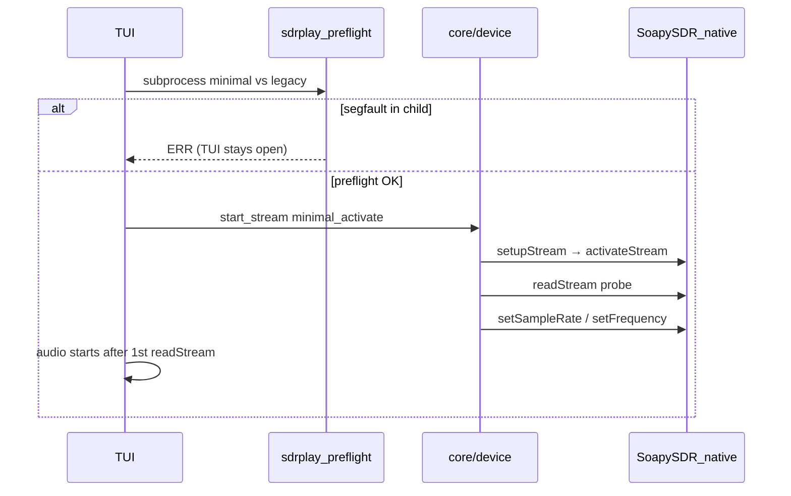

# Hardware setup — xyz-sdr

This guide covers running xyz-sdr with a real SDR (without `--sim`): environment readiness, launch paths, verification, and troubleshooting on Windows with SDRplay.

**Install first:** [installer.md](installer.md) | **Index:** [README.md](README.md)

---

## Simulation vs real hardware

| Mode | How to launch | IQ source | UI log on mount |
|------|---------------|-----------|-----------------|
| **Simulation** | `.\scripts\run.ps1 --sim` | `SimulatedSDR` — 7 fixed stations + noise | `[WARN] Modo SIMULACION` |
| **Real hardware** | `.\scripts\run.ps1` (no `--sim`) | SoapySDR `readStream` | `[OK] Dispositivo abierto: driver=...` |

The **`--sim` gate** in `main.py` (lines ~132–153) forces `driver = "simulated"` when the flag is set. Without `--sim`, the app calls `bootstrap_soapy()` and **exits with code 1** if SoapySDR cannot be imported or no devices are enumerated — it does **not** fall back to simulation automatically.

```python
# main.py — simplified
if args.sim:
    driver = "simulated"
else:
    status = bootstrap_soapy()
    if not (status.import_ok and status.has_devices):
        sys.exit(1)  # prints help; suggests --sim only as optional test mode
```

**Installer vs `run.ps1`:** the Express installer (`setup/install_wizard.py`, option **[2] Ejecutar xyz-sdr**) auto-appends `--sim` when `env_ready` but no SDR is connected. **`scripts/run.ps1` without flags requires hardware.**

---

## Readiness levels

Defined in `setup/env_state.py`:

| Level | Property | Condition | Sufficient for |
|-------|----------|-----------|----------------|
| **Pending** | — | Missing drivers, venv, or Soapy import | Run `install_drivers.ps1` [1] |
| **env_ready** / **sim_ready** | `env_ready` | SDRplay API + Pothos PATH + `.venv` + Soapy import | `.\scripts\run.ps1 --sim` or installer option 2 |
| **hardware_ready** | `hardware_ready` | `env_ready` + `has_devices` | `.\scripts\run.ps1` (no `--sim`) |

Use `readiness_level()` → `"hardware"`, `"env"`, or `"pending"` for diagnostics.

---

## Windows stack (SDRplay)

Bottom to top:

1. **SDRplay API v3** — device driver / service (`sdrplay_api`)
2. **PothosSDR** — `C:\Program Files\PothosSDR\bin` on PATH (SoapySDR + plugins)
3. **SoapySDR plugin `sdrplay`** — `SoapySDRUtil --find=driver=sdrplay`  
   PothosSDR 2021.07.25 ships a **legacy** `sdrPlaySupport.dll` (July 2021) incompatible with SDRplay API **v3.15+**. If `--find=driver=sdrplay` is empty but the RSP appears in Device Manager, build **SoapySDRPlay3**:

```powershell
.\setup\install_drivers.ps1 → [1] Reparar todo   # copia plugin embebido; compila solo si falla
.\setup\install_soapy_sdrplay3.ps1               # mismo flujo (--build para forzar compilación)
```

4. **Project `.venv`** — Python **3.9** (Pothos embedded bindings) or **3.11/3.12** (`pip install SoapySDR`)

The launcher ensures the correct interpreter and re-exec (see below).

---

## Recommended commands

### Prepare / repair environment

```powershell
.\setup\install_drivers.ps1          # [1] Install or repair all
.\setup\install_drivers.ps1 --check  # headless diagnostic
```

Install logs: `var/log/install-*.log` (gitignored).

### Verify before launch

```powershell
.\scripts\run.ps1 --check
.\scripts\run.ps1 --check --verbose   # same as python setup/check_env.py --verbose
.\scripts\run.ps1 --list-dev
SoapySDRUtil --find=driver=sdrplay
```

Expect at least one entry with `driver=sdrplay` (not only `simulated`).

### SDRplay diagnostic (crash / stream issues)

Structured audit of API DLL, Soapy plugin, enumerate, probe, and optional stream test:

```powershell
.\scripts\diagnose_sdrplay.ps1
python main.py --diagnose-sdrplay
python main.py --diagnose-sdrplay --stream-timeout 90
python main.py --diagnose-sdrplay --no-probe
$env:XYZ_SDR_PREFLIGHT_TIMEOUT = "90"
.\scripts\diagnose_sdrplay.ps1
.\scripts\diagnose_sdrplay.ps1 --no-probe
```

If **probe DEGRADED** kills the API service, skip probe and test stream only:

```powershell
Start-Service SDRplayAPIService
Start-Sleep -Seconds 10
.\scripts\diagnose_sdrplay.ps1 --no-probe
```

**Before diagnose:** close xyz-sdr and SDRuno — the RSP1 allows only **one** open handle. Running diagnose while the TUI holds the device causes stream test timeout or `no available RSP devices`.

**Reading probe results:** if the report shows `SoapySDRUtil --probe sdrplay: DEGRADED` and the stdout lists `hardware=RSP1`, the plugin identified your device but crashed on cleanup (known quirk). The **stream test** (minimal vs legacy) is the definitive RX check. Diagnose restarts `SDRplayAPIService` automatically between probe and stream test.

**Timeout:** default stream preflight is **60s total** (30s per path). On slow USB/API, set `XYZ_SDR_PREFLIGHT_TIMEOUT=90` or pass `--stream-timeout 90`.

Session logs (breadcrumbs for open/activate/readStream and TUI lifecycle) are written to `var/log/xyz-sdr-*.log`. After an unexpected exit, `run.ps1` shows a crash splash and reads `var/log/.last-session.json`. On the **next** launch (non-`--sim`), xyz-sdr restarts `SDRplayAPIService` automatically if the previous session ended with a native crash or abnormal exit. Native segfaults in Soapy/sdrplay are **not** catchable in Python; use the log tail + diagnose script to see the last operation before crash.

### Safe SDRplay RX startup (crash on INICIAR RX)

If the TUI closes ~5–10 s after pressing **INICIAR RX** (`S`), check the session log for `device.start_stream` / `setSampleRate` — this is a **native plugin crash**, not audio or waterfall.



| Symptom | Log hint | Action |
|---------|----------|--------|
| TUI dies on **INICIAR RX** | `device.start_stream` then `setSampleRate`; `.last-session.json` → `native_crash` | `.\scripts\diagnose_sdrplay.ps1` — check **stream test recommended path** (`minimal` vs `legacy`) |
| TUI stays open, RX error panel | `[ERR] SDRplay: el plugin crashea al configurar RX` | Close SDRuno; `Restart-Service SDRplayAPIService`; re-run `.\setup\install_sdrplay_api.bat` |
| Probe **DEGRADED** (RSP1 listed, segfault on exit) | `diagnose_sdrplay.ps1` probe line | Usually OK if **stream test minimal** passes; not fatal by itself |
| Stream test **timeout** | `stream test last step: timeout` | Close xyz-sdr/SDRuno; restart service; `$env:XYZ_SDR_PREFLIGHT_TIMEOUT='90'` |
| Preflight SEGFAULT | `sdrplay_rx_preflight: SEGFAULT` in `check_env --verbose` | Reinstall **API** via `.\setup\install_sdrplay_api.bat` (not plugin alone); then `install_soapy_sdrplay3.ps1` if needed |
| Find OK + stream SEGFAULT at `open` | `install_soapy_sdrplay3.ps1` already run | API/service issue — `.\setup\install_sdrplay_api.bat`; verify SDRuno opens RSP1 |

Manual service restart before RX: set `XYZ_SDR_SDRPLAY_RESTART=1` or rely on auto-restart after a prior native crash.

SDRplay API installer (used by `setup/install_drivers.ps1`): [SDRplay_RSP_API-Windows-3.15.exe](https://www.sdrplay.com/software/SDRplay_RSP_API-Windows-3.15.exe)

Offline copy: `resources/installers/win-x64/SDRplay_RSP_API-Windows-3.15.exe` (or `%USERPROFILE%\Downloads\`, `U:\Downloads\`). Install via:

```powershell
.\setup\install_sdrplay_api.bat
.\setup\install_drivers.ps1    # → [A] Avanzado → [1] SDRplay API
```

**SoapyVOLK warning** (`no VOLK config file found. Run volk_profile…`): harmless Pothos/Soapy SIMD notice. It does **not** cause SDRplay segfaults. Optional: run `volk_profile` from `C:\Program Files\PothosSDR\bin` once to silence it; xyz-sdr does not require it.

### Launch

```powershell
.\xyz-sdr.bat
.\xyz-sdr.ps1
.\scripts\run.ps1
.\scripts\run.ps1 --driver sdrplay --freq 100.6 --gain 40
.\scripts\run.ps1 --debug              # RX/UI metrics in log panel every ~3 s
.\scripts\run.ps1 --sim                # optional, no hardware
```

**Stream health:** with RX active, the status bar shows `DROP` when Soapy overflows or IQ reads are incomplete. With `--debug`, the log panel adds `iq drop X% ov N to M` (drop rate, overflows, timeouts over ~3 s).

### Prefer `run.ps1` over raw `python main.py`

Commit **`e9da33e`** fixed venv re-exec so `main.py` and CLI flags (`--debug`, etc.) survive relaunch. Older sessions showed `unknown option --debug` or an interactive REPL when invoking `python main.py` outside `.venv`.

`scripts/run.ps1`:

- Uses `.venv\Scripts\python.exe`
- Invokes `main.py` with all forwarded args (`@args`)
- Triggers `try_reexec_for_soapy()` inside `main.py` when a compatible venv/Python is needed

**Use the wrapper** unless you are already inside `.venv\Scripts\python.exe`.

---

## TUI verification checklist

After launch **without** `--sim`:

1. **Status bar** — shows real driver (e.g. `SDRPLAY`), not `SIM` / `SIMULACION`.
2. **Log panel** — `[OK] Dispositivo abierto: driver=sdrplay` (or your driver).
3. **`S` — INICIAR RX** — spectrum shows **live** signals (not the sim’s fixed 98 / 100.6 / 104.3 MHz pattern).
4. **Zoom** — `Ctrl+←/→` or `+/-`; narrow spans increase FFT detail (adaptive sizing; see [widgets.md](widgets.md)).
5. **Waterfall** — new rows appear at the **top**; empty rows below until history fills the widget height.
6. **Audio** — adjust volume with `V`; demod follows mode (`M`). PASS band via mouse drag (see [passband.md](passband.md)).
7. **Optional** — `.\scripts\run.ps1 --debug` for FPS / RX latency in the log.

### P0 — FM broadcast QA (100.6 MHz example)

Use this checklist when validating demod quality on real hardware (Spain/EU FM):

| Step | Action | Pass criteria |
|------|--------|---------------|
| 0 | `Get-Service SDRplayAPIService` → **Running**; close SDRuno | `SoapySDRUtil --find=driver=sdrplay` shows `Found device` |
| 1 | `.\scripts\run.ps1 --driver sdrplay --freq 100.6 --gain 40` | TUI opens, driver `sdrplay` |
| 2 | Mode **WBFM**, press **`S`** | Live spectrum; audio from station |
| 3 | Esc → **Audio FM / Noise** → **50 µs (EU)**, AGC **ON** | Less treble hiss vs 75 µs on EU stations |
| 4 | **Mouse**: click + drag on timeline/spectrum around 100.6 MHz | Green PASS overlay; status bar shows PASS width |
| 5 | Keys **`[`** / **`]`** | PASS narrows/widens; demod follows |
| 6 | `.\scripts\run.ps1 --debug` | Log panel shows RX/UI/demod/audio metrics every ~3 s |

### Preset matrix (quick audio QA)

| BANDWIDTH | Mode | PASS | Expected |
|-----------|------|------|----------|
| 250 kHz | nbfm | 12.5 kHz | Clean narrow audio; low latency vs old builds |
| 500 kHz | am | 10 kHz | Voice intelligible |
| 1 MHz | wbfm | 200 kHz | **Recommended** FM daily use |
| 2.048 MHz | wbfm | 200 kHz | Reference quality (default design) |
| 4 / 8 MHz | wbfm | 200 kHz | Spectrum wide; **audio ≈ 1–2 MHz** (IQ decimated internally) |

See [audio-presets-research.md](audio-presets-research.md) for DSP profile details.

If enumerate fails but the service shows **Running**, restart the service before debugging code:

```powershell
Restart-Service SDRplayAPIService
SoapySDRUtil --find=driver=sdrplay
```

---

## Performance tuning (if UI or audio stutters)

On real hardware, narrow zoom can scale FFT up to ~65k samples and `band_cache_cols` up to 4096. If you see lag or audio dropouts, lower values in `config/defaults.toml`:

```toml
[dsp]
fft_size = 4096          # default ver configuration.md §[dsp]
band_cache_cols = 512    # default ver configuration.md §[dsp]
fft_avg_windows = 4      # default ver configuration.md §[dsp]
display_fps = 15         # default ver configuration.md §[dsp]
```

Test with **wide zoom** (span = full IQ bandwidth) first, then zoom in.

Only change defaults when you observe problems — no tuning is required for a healthy setup.

---

## Troubleshooting

| Symptom | Likely cause | Action |
|---------|--------------|--------|
| `unknown option --debug` / Python REPL `>>>` | Re-exec before `e9da33e` or wrong Python | `git pull`, use `.\scripts\run.ps1 --debug` |
| App exits before TUI | No Soapy or no device | `.\scripts\run.ps1 --check`, USB cable, close **SDRuno** / other SDR apps |
| `HardwareInitializationError` | Driver / plugin mismatch | `.\scripts\run.ps1 --list-dev`, `.\scripts\run.ps1 --driver sdrplay` |
| `sdrplay_api_Open() failed` | API service stopped/stuck or device in use | **First:** `Get-Service SDRplayAPIService` → if not Running: `Start-Service SDRplayAPIService` or `Restart-Service SDRplayAPIService`. Close SDRuno, replug USB. `SoapySDRUtil --find=driver=sdrplay` must show `Found device`, not only errors in stderr |
| `sdrplay_api_ServiceNotResponding` on RX | SDRplay service busy or stuck | Close SDRuno, unplug/replug USB, restart SDRplay service or PC |
| Flat spectrum / zeros | `readStream` not delivering data | Restart RX (`S`), increase gain, try another USB port |
| `Bandwidth no soportado` | Preset invalid for RSP | Use **BANDWIDTH** selector ([bandwidth.md](bandwidth.md)) |
| Choppy demod audio | Saturated `AudioOutputQueue` + CPU load | Lower FFT / avg / zoom; see [audio.md](audio.md) |
| PATH not active | Terminal opened before install | New terminal or `install_drivers.ps1` [1] |
| Driver change fails at runtime | Device open error | Esc menu rollback to previous driver or `simulated` |
| TUI crash / unexpected exit | Native Soapy crash or abnormal exit | `var/log/xyz-sdr-*.log` (breadcrumbs). `.\scripts\diagnose_sdrplay.ps1` for DLL/plugin audit. Crash splash via `run.ps1` finally. Manual: `.\scripts\restore_terminal.ps1` |
| TUI crash ~6 s on **INICIAR RX** (SDRplay) | Native crash in `setSampleRate` before/during stream activate | See [Safe SDRplay RX startup](#safe-sdrplay-rx-startup-crash-on-iniciar-rx). `diagnose_sdrplay.ps1` reports `minimal` vs `legacy` stream path |
| RX error, TUI stays open | Preflight caught segfault in subprocess | Close SDRuno; restart `SDRplayAPIService`; `setup/install_sdrplay_api.bat` |

**Runtime rollback:** Esc → change driver; on failure the app reverts to the previous driver or simulation ([bandwidth.md](bandwidth.md)).

---

## Related docs

- [README.md](README.md) — documentation index
- [architecture.md](architecture.md) — threading, mailbox, RX worker
- [installer.md](installer.md) — Express wizard
- [bandwidth.md](bandwidth.md) — IQ sample rate and presets
- [passband.md](passband.md) — audible passband (PASS)
- [dsp.md](dsp.md) — demod pipeline
- [audio.md](audio.md) — demodulated audio vs UI effects
- [audio-presets-research.md](audio-presets-research.md) — preset matrix
- [display.md](display.md) — per-column auto-level, thermal palette, speed bar
- [configuration.md](configuration.md) — full TOML reference
- [customization.md](customization.md) — TOML tuning
