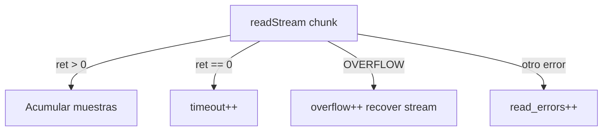

# Observabilidad — stream IQ y rendimiento

Métricas de salud del stream SoapySDR/RTL-SDR, barra de estado y panel de depuración (`--debug`).

Índice: [README.md](README.md) | Hardware: [hardware.md](hardware.md) | Audio: [audio.md](audio.md)

---

## Resumen

| Señal | Dónde | Cuándo |
|-------|-------|--------|
| `DROP` en status bar | Barra inferior TUI | RX activo + hardware real + pérdidas/overflows |
| `iq drop … ov … to …` | Panel log (`#log_panel`) | `--debug`, cada ~3 s |
| `audio u/d` | Panel log | `--debug`, underruns / chunks descartados |
| RX/UI/demod timing | Panel log | `--debug` |

El modo **simulado** (`--sim`) no genera overflows Soapy; `DROP` no aparece (comportamiento esperado).

---

## `StreamStats` (`core/stream_stats.py`)

Contadores acumulados por sesión de stream RX (se reinician al pulsar **INICIAR RX** / `start_stream()`):

| Campo | Significado |
|-------|-------------|
| `samples_requested` | Muestras IQ pedidas a `read_samples()` |
| `samples_received` | Muestras efectivamente leídas |
| `overflows` | Respuestas `SOAPY_SDR_OVERFLOW` de Soapy |
| `timeouts` | `readStream` retorno 0 (timeout 1 s) |
| `read_errors` | Otros códigos de error |
| `recoveries` | Reinicios de stream tras overflow |
| `read_calls` | Invocaciones a `read_samples()` |

Propiedades derivadas:

- **`samples_dropped`** = `requested − received`
- **`drop_rate`** = fracción 0–1 de muestras incompletas

API en dispositivo: `SDRDevice.stream_stats` (copia thread-safe).

---

## Detección en `read_samples()` (`core/device.py`)



Tras overflow (máx. 2 reintentos): `_recover_stream_unlocked()` desactiva, cierra y reactiva el stream.

---

## Barra de estado — indicador `DROP`

Visible cuando:

- RX activo, dispositivo **no** simulado, y
- `stream_overflows > 0` **o** `drop_rate ≥ 0.5%`

Formato:

- `DROP 2.3%` — porcentaje de muestras IQ incompletas desde inicio de RX
- `DROP ov3` — si hay overflows pero el rate es &lt; 0.1%

Interpretación:

| Síntoma | Causa probable |
|---------|----------------|
| `DROP` sube con zoom estrecho + FFT grande | CPU no sigue el pipeline |
| Overflows frecuentes | USB saturado, sample rate alto, hub sin alimentación |
| Timeouts (`to` en debug) | Dispositivo lento o cable/driver |

Mitigación: bajar `sample_rate`, reducir `fft_size` / `band_cache_cols` en `defaults.toml`, usar preset IQ más bajo ([bandwidth.md](bandwidth.md)).

---

## Modo `--debug`

Activa logging DEBUG y timer cada 3 s en `_report_debug_metrics()` (`tui/app.py`).

Ejemplo de línea:

```text
[DEBUG] perf 3.0s | RX 12.1 iter/s proc 8.2ms p95 14.1ms | UI 18.5 fps … | iq drop 1.2% ov 1 to 0 | audio u/d 0/0
```

| Token | Significado |
|-------|-------------|
| `iq drop X%` | Drop rate en ventana (~3 s) |
| `ov N` | Overflows en ventana |
| `to M` | Timeouts en ventana |
| `audio u/d` | Underruns / chunks descartados (`AudioOutputQueue`) |

```powershell
.\scripts\run.ps1 -Debug
.\scripts\run.ps1 -Band fm_broadcast -Debug
```

---

## Tests

```powershell
python -m pytest resources/test/test_stream_stats.py resources/test/test_device_stream.py -q
```

---

## Mapa de archivos

| Archivo | Rol |
|---------|------|
| `core/stream_stats.py` | Dataclass y delta entre ventanas |
| `core/device.py` | Instrumentación en `read_samples()` |
| `tui/app.py` | Status bar `DROP`, `_report_debug_metrics()` |
| `core/audio_output.py` | Underruns / dropped chunks de audio |
