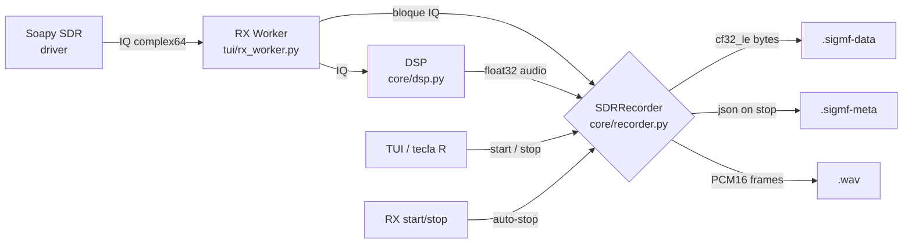

# Grabación — `core/recorder.py`

`SDRRecorder` graba simultáneamente el flujo IQ crudo (formato **SigMF**) y el audio demodulado (formato **WAV PCM16**) mientras RX está activo. La clase es thread-safe y se compone con el pipeline existente (`device.py` → RX worker → DSP → audio) sin bloquear el bucle de demodulación.

> **Estado:** Fase 3 (parcial). Hoy la grabación es **manual**; las claves `auto_record` y `trigger_db` están definidas pero el trigger automático aún no está implementado. Ver [Gaps](#gaps-reconocidos).

---

## Resumen

`SDRRecorder` se inicializa con un directorio de salida y expone `start()` / `write_iq()` / `write_audio()` / `stop()`. Mientras esté activa, cada bloque IQ (`complex64`, intercalado) recibido del worker de RX se vuelca a `.sigmf-data` y, en paralelo, cada bloque de audio post-demod se vuelca a `.wav`. Al detener la grabación, `stop()` cierra los archivos y escribe `core:num_channels`, `core:sample_count` y la marca temporal UTC en el `.sigmf-meta` (JSON SigMF estándar).

* **Activación manual:** tecla `R` o botón lateral `(o) GRABAR IQ`.
* **RX obligatorio:** iniciar/detener RX también inicia/detiene la grabación automáticamente (al detener RX, se llama `_stop_recording(log_stopped=False)`).
* **Concurrencia:** mutex `_lock` protege `_iq_file`, `_wav_file`, `_iq_samples_written` y los flags `_record_iq` / `_record_audio`.
* **Persistencia:** los ajustes editables desde la UI (`record_iq`, `record_audio`) se guardan en `config/defaults.toml` con `patch_recorder_section()` — el resto solo se edita a mano.

---

## Formatos soportados

| Formato | Extensiones | Contenido | Metadata embebida | Cómo se reabre |
|---------|-------------|-----------|-------------------|---------------|
| **SigMF IQ** | `.sigmf-data` + `.sigmf-meta` | IQ complejo `cf32_le`, samples contiguos, intercalado I/Q como `float32` little-endian (4 bytes por componente, 8 bytes por muestra) | `.sigmf-meta` JSON con campos `core:datatype`, `core:sample_rate`, `core:frequency`, `core:datetime`, `core:sample_count`, `core:author`, `core:recorder` | Cualquier tool SigMF: `python -m sigmf examples/notebooks/basic.ipynb`, [Inspectrum](https://github.com/miek/inspectrum), GNU Radio (`blocks:sigmf_source`), etc. La metadata sigue el estándar [SigMF v1.0](https://github.com/ntia/SigMF) — `global.core:datatype = "cf32_le"`. |
| **WAV audio** | `.wav` | PCM16 mono, sample rate configurable (default `audio_rate` = 48000 Hz), cuantizado desde `float32` recortado a `[-1.0, 1.0]` | Cabecera RIFF estándar: 1 canal, 16 bits, `framerate` = `audio_rate`. Sin metadata adicional (no hay cues/chunks específicos). | Reproductor cualquiera: VLC, Audacity, ffmpeg. Para análisis offline: `scipy.io.wavfile.read(path)` o `wave.open(path, "rb")`. |

Notas prácticas:

* `record_iq = true` ⇒ crea `.sigmf-data` + `.sigmf-meta` en pareja. Sin el meta, el data es opaco.
* `record_audio = true` ⇒ solo graba WAV si el modo está en `AUDIO_DEMOD_MODES` = `{wbfm, nbfm, am, usb, lsb, cw, dsb, raw}`. En modo `auto`, la grabación sigue el modo resuelto dinámicamente (ver `recording_targets()` en `core/recorder.py`).
* Tamaño IQ: a 500 kS/s IQ → ~4 MB/s sin metadatos; a 2.048 MHz IQ → ~16 MB/s. WAV a 48 kHz mono PCM16 → ~96 KB/s.
* El binario `.sigmf-data` se cierra en `stop()`; un cuelgue del proceso puede dejar un archivo sin `.sigmf-meta` emparejado (gap menor: cleanup no implementado).

---

## Ruta de almacenamiento

`resolve_recordings_dir(configured, project_root=…)` decide dónde escribir:

1. Si `output_dir` está vacío o `None` → `~/Music/xyz-sdr` (Windows) o `~/Música/xyz-sdr` si la primera no existe.
2. Si es relativa (p.ej. `./recordings`) → se resuelve **respecto a `project_root`** (la raíz del repo, no el CWD). Es el comportamiento que verás desde la app (`project_root` se inyecta desde `XyzSDRApp`).
3. Si es absoluta → se respeta tal cual.

No se crean subdirectorios por fecha o por banda. Todos los archivos viven en el mismo directorio plano.

**Patrón de naming** (calculado en `SDRRecorder.start()`):

```
xyz-sdr_<YYYYMMDD>_<HHMMSS>_<freq-tag>_<MODE>.<ext>
```

Donde `<freq-tag>` es una forma compacta de la frecuencia central (`100.600MHz`, `121500kHz` o `700Hz0Hz` en frecuencias bajas) y `<MODE>` es el modo demod en mayúsculas (`WBFM`, `NBFM`, `AM`, …). El timestamp es **local**, no UTC (la fecha/hora UTC va dentro del SigMF meta).

Ejemplo de sesión:

```
~/Music/xyz-sdr/xyz-sdr_20260625_014530_100.600MHz_WBFM.sigmf-data
~/Music/xyz-sdr/xyz-sdr_20260625_014530_100.600MHz_WBFM.sigmf-meta
~/Music/xyz-sdr/xyz-sdr_20260625_014530_100.600MHz_WBFM.wav
```

Si vuelves a grabar sobre la misma frecuencia segundos después, el timestamp local cambia → no se pisa nada. **No hay límite de archivos, ni rotación, ni limpieza automática** (gap).

---

## Configuración `[recorder]`

Las claves viven en `config/defaults.toml` bajo `[recorder]` y se documentan también en [configuration.md](configuration.md#recorder--grabación-fase-3-parcial). Esta tabla amplía el detalle operativo.

| Clave | Tipo | Default | Description |
|-------|------|---------|-------------|
| `output_dir` | string | `""` | Vacío → `~/Music/xyz-sdr` (o `~/Música/xyz-sdr`). Relativa → respecto al repo. Absoluta → literal. Se crea con `mkdir(parents=True, exist_ok=True)` al iniciar grabación. |
| `record_iq` | bool | `true` | Si está activo, abre `.sigmf-data` + `.sigmf-meta`. Toggle en UI: **Esc → Ajustes de Grabación → Grabar IQ (SigMF)**. |
| `record_audio` | bool | `true` | Si está activo y el modo está en `AUDIO_DEMOD_MODES`, abre `.wav`. Toggle en UI: **Esc → Ajustes de Grabación → Grabar Audio (WAV)**. |
| `iq_format` | string | `"sigmf"` | Reservado para futuros formatos. Hoy solo se implementa SigMF (`"sigmf"`). Valores `"raw"` / `"wav"` no operativos aún. |
| `audio_format` | string | `"wav"` | Reservado. Solo se implementa WAV PCM16. |
| `auto_record` | bool | `false` | **Reservado** — no implementado todavía. Se documenta aquí para que la config sea estable; el trigger automático se añadirá en una fase posterior. |
| `trigger_db` | float | `-50.0` | Umbral en dBFS pensado para `auto_record`. Sin efecto hoy. Cuando se implemente, disparará la grabación cuando el SNR del passband supere este valor (referencia: ver el detector del scanner, que ya mide SNR en el passband — [scanner.md](scanner.md)). |

Persistencia: `patch_recorder_section()` solo expone `record_iq` y `record_audio` desde la UI; las demás claves se editan a mano en el TOML (ver [configuration.md](configuration.md#persistencia-desde-la-ui)).

---

## Activación manual

| Vía | Detalle |
|-----|---------|
| **Tecla `R`** | Binding `BINDINGS` en `XyzSDRApp` (`action_record`). Si RX no está activo, reproduce sonido de error y loguea `[ERROR] Inicia RX antes de grabar`. |
| **Botón `(o) GRABAR IQ`** | ID `#btn_rec`, `variant="warning"`. Mismo handler. No cambia de etiqueta al grabar — el estado se ve en la status bar con el indicador `● REC` (rojo). |
| **Auto-stop** | Al detener RX (tecla `S` o botón `>> INICIAR RX`), `_stop_rx()` llama `_stop_recording(log_stopped=False)` → no suena el blip de cierre ni se loguea dos veces. |

Al pulsar:

1. `action_record()` evalúa el flag `_recording`.
2. Si está activo → `_stop_recording()`: cierra archivos, escribe `.sigmf-meta`, loguea `[OK] Grabacion IQ detenida: <path>` (y análogo para WAV), reproduce `blip`.
3. Si no → `_start_recording()`: resuelve dir, crea `SDRRecorder`, llama `recording_targets()` para decidir IQ y audio, llama `recorder.start(...)`. Si todo OK → `_recording = True`, loguea `[OK] Grabacion IQ: <path>` / `[OK] Grabacion audio: <path>`, blip, `update_status()` con `recording=True`.
4. Si falla (`ValueError` por no tener IQ ni audio, error de I/O, etc.) → sonido de error + `[ERROR]`.

El log de eventos aparece en el panel `Log` de la TUI y también en el log estándar (`logging.getLogger(__name__)` → INFO).

---

## Trigger automático (`auto_record` + `trigger_db`)

**Estado actual:** no implementado. Las claves existen en el TOML y aparecen en `configuration.md` como Fase 3 (parcial), pero no hay rama de código que las consuma.

Cuando se implemente, la lógica prevista es:

* **Medición:** SNR del passband (ventana audible `[passband_center ± passband_width/2]`) usando `max(ceilings - floors)` del auto-level por columnas — el mismo cálculo que ya hace `_handle_scanner_step()` en `tui/app.py`.
* **Disparo:** iniciar grabación cuando `passband_snr ≥ trigger_db` durante ≥ N ms (anti-debounce).
* **Detención opcional:** parar cuando `passband_snr < trigger_db - hysteresis` durante ≥ `dwell_ms`.
* **Histéresis:** un único umbral sin histéresis provoca parpadeo en señales moduladas (p.ej. FM con silenciador natural). El valor `trigger_db` documentado es el umbral alto; el bajo se derivaría como `trigger_db - hysteresis_db` (config por añadir).

> Mientras `auto_record = false` (default), el comportamiento es exclusivamente manual.

---

## Rotación / limpieza

**No hay rotación ni limpieza automática.** El grabador:

* Crea archivos nuevos en cada `start()` con timestamp local al segundo.
* No borra, comprime, ni archiva archivos antiguos.
* No impone límite de tamaño, número de archivos, ni tiempo máximo por sesión.

Responsabilidad del usuario:

* Vigilar el espacio en disco (a 2 MHz IQ y 1 hora ⇒ ~57 GB en `.sigmf-data`).
* Mover/borrar manualmente el contenido de `~/Music/xyz-sdr` (o el `output_dir` configurado).
* Si necesitas rotación, considera un script externo (p.ej. `find ~/Music/xyz-sdr -name "*.sigmf-data" -mtime +30 -delete`).

Limitaciones de cierre limpio:

* Si la app se cierra abruptamente (Ctrl+C dos veces, crash de Soapy, etc.) puede quedar un `.sigmf-data` sin `.sigmf-meta` emparejado.
* El WAV siempre se cierra vía `wave.Wave_write.close()` en `stop()`; los tools estándar lo toleran (añaden ceros al final si falta la cabecera RIFF final, pero en nuestro caso `close()` sí la escribe).

---

## Tubería (pipeline)



---

## Ejemplo de sesión

```toml
# config/defaults.toml — extract
[recorder]
output_dir    = "./recordings"   # relativa → /repo/recordings
record_iq     = true             # SigMF IQ siempre
record_audio  = true             # WAV demodulado si modo compatible
iq_format     = "sigmf"
audio_format  = "wav"
auto_record   = false            # manual por ahora
trigger_db    = -50.0            # reservado
```

Flujo típico (FM broadcast):

1. `.\scripts\run.ps1 -Band fm_broadcast` → arranca en 100.6 MHz, modo WBFM, IQ 1 MHz.
2. Pulsa `S` → inicia RX. Status bar muestra `MODE WBFM`, `BW 1.000MHz`.
3. Pulsa `R` → comienza grabación:
   * Log: `[OK] Grabacion IQ: C:\…\recordings\xyz-sdr_20260625_014530_100.600MHz_WBFM.sigmf-data`
   * Log: `[OK] Grabacion audio: C:\…\recordings\xyz-sdr_20260625_014530_100.600MHz_WBFM.wav`
   * Status bar: aparece `● REC` rojo.
4. Escuchas unos minutos. El IQ y el WAV crecen a ~8 MB/s y ~96 KB/s respectivamente.
5. Pulsa `S` → detiene RX → grabación se cierra sola (sin blip, sin log de cierre).
6. Inspección:
   * `python -c "import json; print(json.dumps(json.load(open('xyz-sdr_..._WBFM.sigmf-meta')), indent=2))"` → ves la metadata SigMF.
   * `ffprobe xyz-sdr_..._WBFM.wav` → 48 kHz mono PCM16.

Para abrir el IQ en GNU Radio:

```python
from gnuradio import blocks, sigmf
src = sigmf.source('xyz-sdr_..._WBFM.sigmf-meta', sigmf.block_format('fc32'))
```

---

## Tests relevantes

* `resources/test/test_recorder.py` — cubre `resolve_recordings_dir` (defaults y rutas relativas/absolutas), `recording_targets` (matriz modos), `SDRRecorder` end-to-end con IQ sintético y verificación de `.sigmf-meta`.
* `resources/test/test_sdr_features.py::test_patch_recorder_and_scanner_config` — verifica la persistencia parcial de claves (no reescribe comentarios).

```powershell
python -m pytest resources/test/test_recorder.py -q
```

---

## Gaps reconocidos

1. **Auto-trigger no implementado.** Las claves `auto_record` y `trigger_db` están en `config/defaults.toml` y documentadas, pero ningún código las lee. La medición de SNR ya existe en `_handle_scanner_step` (TUI), reutilizable.
2. **Sin rotación ni limpieza.** Ni tamaño máximo, ni edad máxima, ni cuota de disco.
3. **`iq_format` y `audio_format` solo aceptan `sigmf` / `wav` respectivamente.** Los valores `"raw"` y `"wav"` (para IQ) son string pero no operativos.
4. **Sin `.sigmf-meta` parcial en caso de crash.** Si el proceso muere entre `start()` y `stop()`, el `.sigmf-data` queda huérfano. Considerar escribir un `.sigmf-meta` provisional al `start()` y sobrescribirlo en `stop()`.
5. **Sin gestión de quota / aviso al usuario.** A 2 MHz IQ una sesión larga llena el disco; no hay warning.
6. **No hay binding de teclado para pausar/reanudar** — solo iniciar/detener. La status bar muestra `● REC` mientras graba.

---

## Referencias cruzadas

* [configuration.md](configuration.md#recorder--grabación-fase-3-parcial) — referencia canónica de las claves TOML.
* [dsp.md](dsp.md) — pipeline IQ → audio.
* [scanner.md](scanner.md) — el detector de SNR en passband que se reutilizará para auto-record.
* [observability.md](observability.md) — drop rate del stream (afecta a la integridad de la grabación IQ).
* `core/recorder.py` — implementación.
* `core/config_store.py::patch_recorder_section` — persistencia parcial.