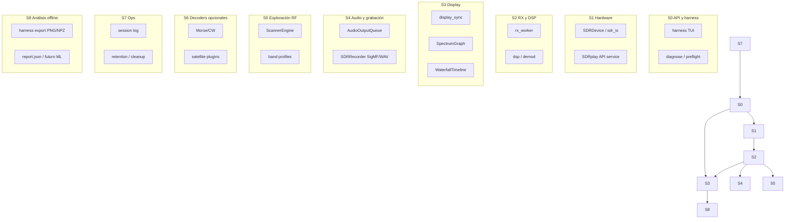

# Roadmap plataforma SDR — control, análisis y cobertura espectral

Documento maestro que **reformula los objetivos del proyecto** en fases ejecutables, con sectores técnicos, documentación, scripts, tests y criterios de “hecho”. Complementa el [roadmap histórico](roadmap.md) (fases 1–6 originales).

Índice: [README.md](README.md) | Harness: [testing.md § Harness](testing.md#harness-espectrowaterfall-diagnóstico)

---

## 1. Objetivo reformulado (de tu prompt al alcance real)

### Lo que pedías (intención)

> Control total del RSP, espectro + waterfall fiables, grabación multi-formato, escaneo de frecuencias en todo el rango del SDR, decodificación (Morse, satélites), análisis de capturas/imágenes, logs gestionados sin saturar disco, refactor por sectores con docs/scripts/tests, y menú Esc ampliado (sonido/grabación).

### Objetivo de producto xyz-sdr (v0.3 → v1.0)

**Construir una plataforma TUI de recepción y análisis SDR** donde:

1. El **hardware RSP** se controla de forma predecible (abrir, tunear, BW, gain, stream, recovery).
2. El **pipeline RX → espectro → cascada → audio** es observable, testeable y exportable (harness).
3. La **cobertura espectral** se explora por perfiles de banda + escáner + bookmarks (no “0–2500 MHz continuos” en un solo stream).
4. La **grabación** (IQ SigMF + audio WAV, formatos ampliables) se configura desde Ajustes.
5. Los **decodificadores especializados** (Morse, satélite, etc.) son plugins opcionales, no bloquean el núcleo.
6. **Logs y artefactos** (`var/log`, `var/harness`, grabaciones) tienen retención automática configurable.

### Límite hardware (importante)

| Dispositivo | Rango típico | BW máx. IQ (RSP1) | Nota |
|-------------|--------------|-------------------|------|
| **SDRplay RSP1** | ~1 kHz – **2.0 GHz** | hasta **2.048 MHz** (según driver) | No cubre 2.0–2.5 GHz |
| RSP1A / RSPdx | hasta ~2 GHz / más en dx | similar Soapy | Detectar modelo en runtime |

“Escuchar en todas las bandas” = **catálogo de perfiles + escáner + sintonía manual** sobre el rango soportado por *tu* unidad, no un único espectro de 2.5 GHz.

---

## 2. Arquitectura por sectores (control plane)



Cada sector debe tener **doc + script(s) + tests** antes de considerarse “cerrado”.

| Sector | Responsabilidad | Docs actuales | Scripts | Tests |
|--------|-----------------|---------------|---------|-------|
| **S0** API conocimiento / harness | Validar display sin app completa | [testing.md](testing.md) | `scripts/harness.ps1`, `python -m tui.harness` | `test_sdr_display_harness.py` |
| **S1** Hardware RSP | open/stream/tune/recovery | [hardware.md](hardware.md), [sdrplay-matrix.md](sdrplay-matrix.md) | `diagnose_sdrplay.ps1`, `list_soapy_devices.py` | `test_device_stream.py`, `test_sdrplay_*` |
| **S2** RX + DSP | IQ → PSD → audio | [dsp.md](dsp.md), [bandwidth.md](bandwidth.md) | `test_sdrplay_data.py` | `test_dsp.py`, `test_rx_warmup.py` |
| **S3** Display | espectro + waterfall | [display.md](display.md) | harness export | `test_display_pipeline.py`, `test_spectrum_viewport.py` |
| **S4** Audio + grabación | WAV/SigMF, menú Esc | [audio.md](audio.md), [recorder.md](recorder.md) | — | `test_recorder.py`, `test_storage_*` |
| **S5** Exploración RF | escáner, perfiles, bookmarks | [scanner.md](scanner.md), [bookmarks.md](bookmarks.md) | — | `test_scanner_engine.py` |
| **S6** Decoders | Morse, satélite, etc. | *nuevo* `decoders.md` | *plan* `scripts/decode_*.ps1` | *plan* por decoder |
| **S7** Ops / logs | sesión, retención, basura | [logging.md](logging.md), [observability.md](observability.md) | *plan* `scripts/cleanup_var.ps1` | `test_logging_config.py` |
| **S8** Análisis capturas | PNG/NPZ/report, IA opcional | *este doc §8* | harness `--headless` | `test_sdr_display_harness.py` |

---

## 3. Fases de implementación (orden recomendado)

### Fase A — Display y control RSP fiables (P0, **ahora**)

**Meta:** espectro + waterfall en la app principal con el mismo pipeline que el harness (`display_ok: true` en hardware real).

| Entrega | Acción |
|---------|--------|
| A.1 | Corregir bug display en `tui/app.py` usando harness como fuente de verdad |
| A.2 | `core/sdr_control.py` (fachada fina): `open`, `tune`, `set_bandwidth`, `start_rx`, `stop_rx`, `health()` |
| A.3 | Unificar recovery SDRplay (sin reinicio API con device abierto) en app + harness |
| A.4 | Doc: [testing.md](testing.md) + checklist manual RSP |
| A.5 | Audio: iniciar `AudioOutputQueue` en `_start_rx` (hilo principal), selector `audio_output_device` | ✅ |

**Criterio hecho:** 3 ciclos RX ON/OFF + captura harness con `display_ok: true` + **audio audible** (log `[OK] Salida de audio`).

---

### Fase I — Clean screen y rendimiento TUI (P0, **paralelo a A**)

**Síntoma:** texto de scrollback (splash, logs, secuencias ratón tipo `[11111;…M`) visible *detrás* o *sobre* la UI; lag extra al redibujar.

**Causas conocidas:**

| Causa | Mitigación |
|-------|------------|
| Splash escribe en buffer principal sin alternate screen | `prepare_terminal_for_tui()` → `\033[?1049h` + clear antes de `app.run()` |
| Secuencias SGR de ratón impresas como texto | `restore_terminal_after_tui()` + `XYZ_SDR_NO_MOUSE=1` si persiste |
| Logging/Soapy a stdout durante RX | `detach_console_logging()`; auditar salida nativa en stream |
| Timer display 20 Hz con RX off | No refrescar espectro si `not _rx_active` (ya parcial) |
| Redibujado splash cada 250 ms | Throttle splash (hecho); handoff con clear final |

| Entrega | Acción | Estado |
|---------|--------|--------|
| I.1 | Alternate screen + clear en `core/console_utf8.py` | ✅ |
| I.2 | Handoff splash → Textual con `_clear_screen()` + prepare | ✅ |
| I.3 | Doc troubleshooting en [hardware.md](hardware.md) § Clean screen | plan |
| I.4 | `scripts/restore_terminal.ps1` en atajos README si UI corrupta | existe |
| I.5 | Opción menú Esc → **Rendimiento**: ratón on/off, FPS display | plan |
| I.6 | Suprimir stdout nativo Soapy durante `readStream` (env flag) | plan |
| I.7 | Tests `test_console_utf8.py` + smoke TUI sin basura en scrollback | ✅ parcial |

**Workaround inmediato (usuario):**

```powershell
$env:XYZ_SDR_NO_MOUSE = "1"
.\scripts\run.ps1
# Si la consola queda corrupta:
.\scripts\restore_terminal.ps1
```

**Criterio hecho:** arranque TUI sin texto del splash/código visible; sin secuencias ratón en pantalla tras 5 min de uso; FPS UI estable con `--debug`.

---

### Fase B — Observabilidad y limpieza automática (P0)

**Meta:** monitorear stream, no llenar disco.

| Entrega | Acción |
|---------|--------|
| B.1 | `core/retention.py`: políticas por carpeta (`var/log`, `var/harness`, grabaciones) |
| B.2 | Config `[retention]` en TOML: `max_age_days`, `max_total_mb`, intervalo |
| B.3 | `scripts/cleanup_var.ps1` + tarea al arranque / timer en app |
| B.4 | Ampliar [observability.md](observability.md) con métricas harness |

**Criterio hecho:** tras N días simulados, carpetas no superan límites configurados.

---

### Fase C — Grabación y menú Esc → Sonido (P1)

**Meta:** WAV/SigMF hoy; formatos extra desde UI.

| Entrega | Acción |
|---------|--------|
| C.1 | Panel **Sonido** en `settings_menu.py`: formato audio (WAV/FLAC/OGG), ruta, IQ on/off |
| C.2 | `SDRRecorder`: backends opcionales (`soundfile` FLAC, `ffmpeg` pipe) |
| C.3 | Trigger `auto_record` + `trigger_db` (ya en TOML, sin implementar) |
| C.4 | Doc [recorder.md](recorder.md) actualizado |

**Dependencias opcionales:** `pydub` o `ffmpeg` en PATH para conversión.

---

### Fase D — Cobertura espectral y búsqueda de frecuencias (P1)

**Meta:** explorar el rango útil del RSP de forma sistemática.

| Entrega | Acción |
|---------|--------|
| D.1 | Perfiles `config/bands/` para HF/VHF/UHF/L-band (dentro de 2 GHz) |
| D.2 | Mejorar `ScannerEngine`: binding teclado, peak en espectro (columna max), export hit list |
| D.3 | `scripts/scan_band.ps1 --profile airband` (headless opcional) |
| D.4 | Integrar resultados escáner → bookmarks |

**Nota:** búsqueda = escáner + detección de picos en `band_cols`, no FFT de 2 GHz de ancho.

---

### Fase E — Análisis de capturas e imágenes (P2)

**Meta:** agente/humano analiza si el display funciona; base para IA.

| Entrega | Acción |
|---------|--------|
| E.1 | Contrato `report.json` estable (ya en harness) |
| E.2 | `tools/analyze_capture.py`: lee NPZ/PNG, emite diagnóstico texto |
| E.3 | Opcional: integración IA (Whisper ya en roadmap fase 4) para *audio*, no espectro |
| E.4 | Doc `docs/capture-analysis.md` |

---

### Fase F — Decodificación Morse / CW (P2)

**Meta:** decoder CW en tiempo real o sobre grabación WAV.

| Entrega | Acción |
|---------|--------|
| F.1 | `core/decoders/cw.py`: goertzel / bandpass + umbral |
| F.2 | Modo `cw` en TUI con salida en log |
| F.3 | Tests con tonos sintéticos |
| F.4 | Doc `docs/decoders.md` § CW |

**Dependencias:** ninguna exótica (numpy/scipy).

---

### Fase G — Señales satelitales (P3, plugins)

**Meta:** decoders como módulos opcionales, no en el hot path RX.

| Candidato | Librería / enfoque | Banda típica |
|-----------|-------------------|--------------|
| NOAA APT | `aptdec` / custom FM+line | 137 MHz |
| Meteor LRPT | `lrpt-decoder` | 137 MHz |
| Inmarsat Aero | narrowband USB | L-band |

| Entrega | Acción |
|---------|--------|
| G.1 | `core/decoders/satellite/` + interfaz común `DecoderPlugin` |
| G.2 | Un decoder piloto (APT NOAA) tras Fase D airband |
| G.3 | `requirements-satellite.txt` opcional |
| G.4 | Scripts `scripts/decode_apt.ps1` |

---

### Fase H — Refactor estructural y API pública (transversal)

**Meta:** código mantenible; sectores desacoplados.

| Entrega | Acción |
|---------|--------|
| H.1 | Extraer `tui/rx_controller.py` (start/stop/recovery) de `app.py` |
| H.2 | `XyzSDRApp` solo orquesta UI; harness y app usan mismos controladores |
| H.3 | Cobertura tests por sector ≥ umbral CI (ver [testing.md](testing.md)) |
| H.4 | [architecture.md](architecture.md) actualizado con diagrama sectores |

---

## 4. Matriz scripts planificados

| Script | Sector | Propósito |
|--------|--------|-----------|
| `scripts/harness.ps1` | S0, S3, S8 | ✅ Captura display + report |
| `scripts/diagnose_sdrplay.ps1` | S1 | ✅ Salud API/plugin |
| `scripts/cleanup_var.ps1` | S7 | Retención logs/harness |
| `scripts/scan_band.ps1` | S5 | Escaneo headless por perfil |
| `scripts/record_session.ps1` | S4 | Grabación IQ+audio con timeout |
| `scripts/analyze_capture.ps1` | S8 | Analiza carpeta harness |
| `scripts/decode_cw.ps1` | S6 | Morse offline sobre WAV |
| `scripts/decode_apt.ps1` | S6 | APT NOAA sobre WAV/IQ |

---

## 5. Matriz tests planificados

| Archivo | Sector | Cubre |
|---------|--------|-------|
| `test_sdr_display_harness.py` | S0, S3 | ✅ pipeline display |
| `test_rx_display_recovery.py` | S1, S3 | recovery RX/display |
| `test_device_stream.py` | S1 | stream Soapy |
| `test_recorder.py` | S4 | SigMF/WAV |
| `test_scanner_engine.py` | S5 | escáner |
| `test_retention.py` | S7 | *plan* cleanup |
| `test_decoders_cw.py` | S6 | *plan* Morse |
| `test_sdr_control.py` | S1, H | *plan* fachada API |

---

## 6. Menú Esc — apartado Sonido (diseño objetivo)

Ubicación: `tui/widgets/settings_menu.py` → pestaña **Sonido / Grabación**.

| Control | Config TOML | Fase |
|---------|-------------|------|
| Formato audio | `recorder.audio_format` = wav \| flac \| ogg | C |
| Carpeta salida | `recorder.output_dir` | ✅ parcial |
| Grabar IQ / audio | `record_iq`, `record_audio` | ✅ |
| Auto-grabación umbral dB | `auto_record`, `trigger_db` | C |
| Sample rate audio | `dsp.audio_rate` | ✅ |
| Volumen / squelch | `dsp.volume`, `squelch_*` | ✅ |

---

## 7. Dependencias nuevas (por fase)

| Fase | Paquete | Uso |
|------|---------|-----|
| A | — | reutilizar stack actual |
| B | — | stdlib + pathlib |
| C | `soundfile` (ya runtime) | FLAC |
| C | ffmpeg (sistema) | OGG/MP3 opcional |
| E | Pillow (dev) | ✅ análisis PNG harness |
| F | — | numpy/scipy |
| G | aptdec / lrpt-* | satélite (opcional, `requirements-satellite.txt`) |

---

## 8. Prioridad inmediata (siguiente sprint)

1. **Ejecutar harness con RSP real** y adjuntar `var/harness/*/report.json` si `display_ok: false` en app principal.
2. **Fase A.1** — alinear `tui/app.py` con `tui/display_sync.py` + fixes mailbox/timer (ya parcialmente hecho).
3. **Fase B.1** — `core/retention.py` + `cleanup_var.ps1` (impacto rápido en disco).
4. **No iniciar Fase G** hasta que Fase A esté verde en hardware.

---

## 9. Relación con roadmap original

| Roadmap v1 (fases 1–6) | Roadmap plataforma |
|------------------------|-------------------|
| Fase 1 TUI | S3 + parte S0 ✅ |
| Fase 2 DSP/audio | S2 + S4 (en curso) |
| Fase 3 grabación/escáner | S4 + S5 (parcial) |
| Fase 4–5 IA | S8 + E.3 (opcional) |
| Fase 6 remoto | fuera de alcance v1.0 |

Actualizar [roadmap.md](roadmap.md) cuando se cierre cada fase A–H.

---

## 10. Glosario

| Término | Significado |
|---------|-------------|
| `display_ok` | Flag harness: frames + cascada + contraste dB mínimo |
| Sector | Dominio técnico con doc/script/tests propios |
| Control plane | API estable para hardware + RX sin depender de la TUI |
| Perfil de banda | `config/bands/*.toml` — centro + BW + modo óptimo |
