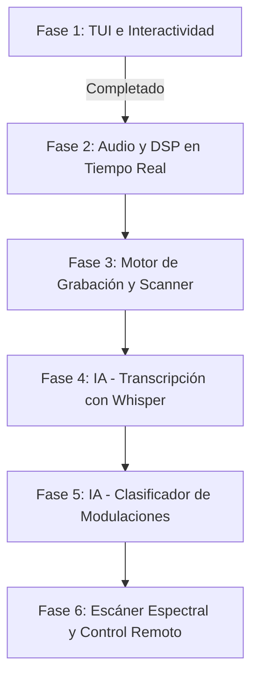

# Plan de ruta — xyz-sdr

Plan de desarrollo incremental del controlador SDR en terminal.

Índice: [README.md](README.md)

> **Roadmap ampliado (sectores, harness, decoders, retención):** ver [roadmap-platform.md](roadmap-platform.md) y [api-control-plane.md](api-control-plane.md).

---

## Fases del proyecto

---

## Fase 1: Interfaz de terminal (TUI) — completada

**Objetivo:** interfaz visual en terminal fluida e interactiva.

**Hitos:**

- Layout 2 paneles (controles + espectros)
- `FrequencyTimeline`, `SpectrumGraph`, `WaterfallTimeline` con ratón y teclado
- Agregación `np.max` en FFT/cascada para spans amplios
- Zoom dinámico, barra FPS cascada, gradiente térmico 32 pasos
- SoapySDR + fallback `--sim`

Documentación: [widgets.md](widgets.md), [display.md](display.md), [architecture.md](architecture.md).

---

## Fase 2: Demodulación y DSP — en desarrollo (núcleo implementado)

**Objetivo:** decodificación analógica y audio en tiempo real.

**Completado:**

| Área | Detalle | Docs |
|------|---------|------|
| Demod | WBFM, NBFM, AM, USB, LSB + PASS | [passband.md](passband.md), [audio.md](audio.md) |
| Perfiles | `core/dsp_profiles.py` por preset IQ | [bandwidth.md](bandwidth.md), [dsp.md](dsp.md) |
| Remuestreo | IQ pre-demod + audio exacto 48 kHz | [dsp.md](dsp.md) |
| FM | De-emphasis 50/75 µs, AGC, `FmDemodState` | [dsp.md](dsp.md) |
| Salida | `AudioOutputQueue`, squelch, underrun stats | [audio.md](audio.md) |
| QA | Tests parametrizados 6 presets | [audio-presets-research.md](audio-presets-research.md) |

**Pendiente:**

- Estéreo WBFM / RDS
- Modos UI `cw`, `dsb`, `raw`, `auto`
- Buffer circular dedicado si underruns persisten en 250 kHz
- QA hardware P0 documentado en [hardware.md](hardware.md)

---

## Fase 3: Grabación y escáner — planificado

**Objetivo:** almacenar IQ/audio e implementar barridos automáticos.

- SigMF / WAV, reproducción de archivos IQ
- Escáner entre `scanner.freq_start` … `freq_end` ([configuration.md](configuration.md))

Claves TOML ya definidas en `[recorder]` y `[scanner]`.

---

## Fase 4: IA — transcripción Whisper — planificado

- `faster-whisper`, VAD, panel de transcripciones en `#log_panel`
- Claves `[ai].whisper_*`

---

## Fase 5: IA — clasificador de modulaciones — planificado

- Características espectrales + modelo sklearn local
- Indicador en status bar

---

## Fase 6: Optimización y control remoto — planificado

- FFT con `pyFFTW`
- API WebSocket / cliente web remoto

---

## Fase 7+ (plataforma) — ver roadmap-platform.md

| Fase | Tema | Estado |
|------|------|--------|
| A | Display + control RSP fiable (harness como verdad) | **P0 — en curso** |
| I | Clean screen + lag TUI (alternate buffer, ratón) | **P0 — en curso** |
| B | Retención logs / `var/` automática | planificado |
| C | Grabación multi-formato + menú Esc Sonido | planificado |
| D | Cobertura espectral + escáner mejorado | planificado |
| E | Análisis capturas harness / imágenes | harness ✅ base |
| F | Decoder Morse/CW | planificado |
| G | Decoders satélite (plugins opcionales) | planificado |
| H | Refactor `sdr_control` + sectores | planificado |

---

## Instalador y entorno

Fase transversal completada: wizard Express Windows — [installer.md](installer.md).
