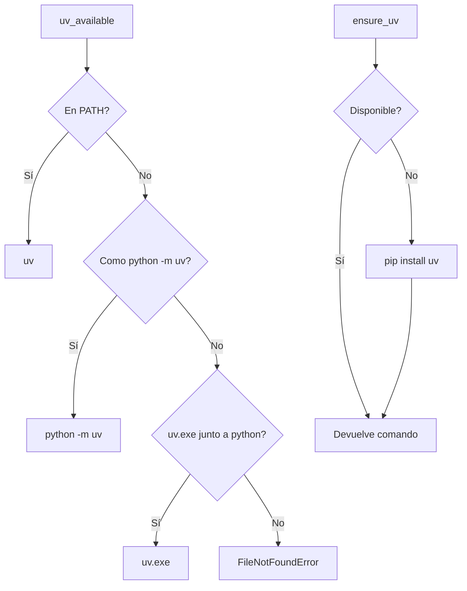

# uv runtime — xyz-sdr

`core/uv_runtime.py` (123 líneas) aísla el uso de [`uv`](https://github.com/astral-sh/uv) como gestor de paquetes preferido para creación de venvs e instalación de requirements.

> **¿Por qué uv?** Es ~10× más rápido que `pip` para resolver e instalar, soporta PEP 621 nativamente y maneja mejor los wheels binarios (especialmente numpy/scipy en Windows). El proyecto lo usa donde la velocidad importa: instalación inicial del venv y bulk install de requirements.

---

## API pública

### `uv_available(python_exe=None) -> bool`

`True` si `uv` está en PATH o disponible como `python -m uv` en el intérprete dado.

```python
from core.uv_runtime import uv_available
if uv_available():
    print("uv listo")
```

### `resolve_uv_command(python_exe=None) -> list[str]`

Devuelve el prefijo de comando para invocar uv. Orden de preferencia:

1. Binario en `PATH` (`shutil.which("uv")`).
2. `python -m uv` (si uv está instalado como módulo del intérprete).
3. `<python_dir>/uv[.exe]` (fallback junto al ejecutable de Python).
4. `FileNotFoundError` si nada funciona.

```python
cmd = resolve_uv_command()  # ['uv'] o ['C:\\Python39\\python.exe', '-m', 'uv']
```

### `ensure_uv(python_exe=None) -> list[str]`

Garantiza uv disponible; lo instala con `pip install uv` si hace falta. Devuelve el prefijo listo para `subprocess`.

```python
cmd = ensure_uv()  # lo instala si no está
subprocess.run([*cmd, "pip", "install", "-r", "requirements.txt"])
```

### `uv_pip_install(requirements, *, python_exe=None, system=False, cwd=None, uv_python=None) -> None`

Wrapper sobre `uv pip install -r <requirements>` con timeouts y selección de intérprete:

| Parámetro | Default | Significado |
|-----------|---------|-------------|
| `requirements` | (required) | Path a `requirements.txt` o similar |
| `python_exe` | `sys.executable` | Python destino (venv) |
| `system` | `False` | Si `True`, instala en el Python del sistema (`--system`) |
| `cwd` | `None` | Working directory del subprocess |
| `uv_python` | `None` | Override del Python (alternativa a `python_exe`) |

### `uv_create_venv(venv_dir, *, base_python, installer_python=None) -> Path`

Crea un venv con `uv venv --seed --python <base>` y devuelve el path al `python.exe`/`python` resultante. Útil en instalador (`setup/install_actions.py`).

```python
py = uv_create_venv(".venv", base_python="C:\\Python39\\python.exe")
# py = Path(".../.venv/Scripts/python.exe")  en Windows
# py = Path(".../.venv/bin/python")          en Unix
```

---

## Diagrama de decisión



---

## Integración con el proyecto

`uv_runtime` se usa en:

- **`setup/install_actions.py`** (`_ensure_uv`, `uv_pip_install`, `uv_create_venv`) — instalador Windows.
- **`core/python_runtime.py`** — bootstrap de Python con SoapySDR.

El runtime normal (modo `-Sim` o hardware real) **no** usa uv directamente; consume el venv ya provisionado.

---

## Decisiones y trade-offs

- **No se fuerza uv**: si el usuario tiene `pip` y no `uv`, el instalador cae a `pip` transparentemente.
- **Timeouts**: 20s para `--version`, 300s para `pip install uv`, 600s para bulk install.
- **Sin subprocess shell**: todo va con `subprocess.run([...], shell=False)` para evitar inyección.
- **Cross-platform**: detecta `uv.exe` en Windows, `uv` en Unix.

---

## Tests

`resources/test/test_uv_runtime.py` cubre las rutas principales. Pendiente: tests con mocks de `subprocess` para validar timeouts y fallbacks en CI sin red.

---

## Ver también

- [`installer.md`](installer.md) — wizard que consume uv
- [`python_runtime.py`](../core/python_runtime.py) — bootstrap Soapy
- [uv docs](https://docs.astral.sh/uv/)