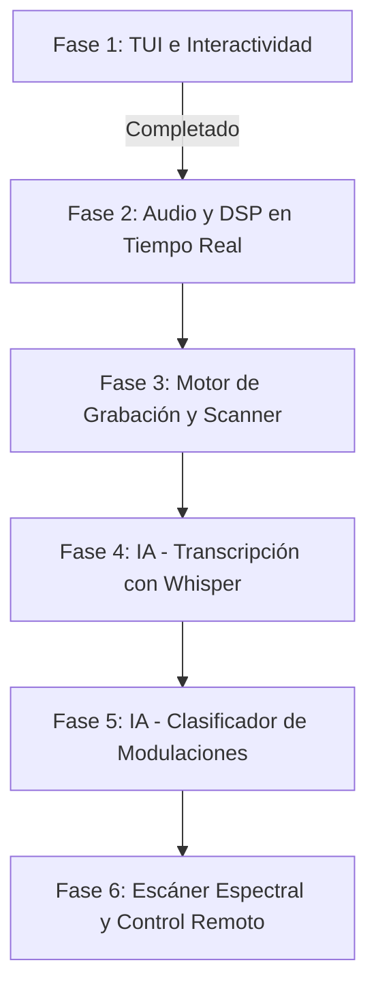

# 🗺️ Plan de Ruta de Desarrollo (Roadmap) — xyz-sdr

Este documento detalla el plan de desarrollo incremental para el controlador SDR en terminal.

---

## 📈 Fases del Proyecto

---

## 🟢 Fase 1: Interfaz de Terminal (TUI) e Interactividad [COMPLETADA]
* **Objetivo**: Crear una interfaz visual en terminal fluida, interactiva y robusta que emule programas SDR de escritorio.
* **Hitos logrados**:
  * Implementación del layout principal de 2 paneles (controles a la izquierda, espectros a la derecha).
  * Creación del widget `FrequencyTimeline` con lectura digital en Hz y tracking de ratón en hover.
  * Implementación de agregación de picos (`np.max`) en el espectro FFT (`SpectrumGraph`) y cascada (`WaterfallTimeline`) para evitar la pérdida de portadoras a spans amplios.
  * Interactividad completa en los 3 widgets gráficos: sintonía mediante scroll y clic con el ratón, zoom dinámico con `Ctrl + rueda` y zoom/scroll/centrado por teclado.
  * Gradiente de color de 32 pasos con atenuación de ruido a negro (simulación de opacidad) e indicador visual `░` para regiones sin cobertura de muestreo.
  * Panel vertical derecho de velocidad de desplazamiento de cascada (`1, 2, 3, 5, 10, 25, 50 FPS`).
  * Estructuración del soporte de hardware SoapySDR y fallback a simulador con ruido gaussiano si no hay SDR conectado.

---

## 🟡 Fase 2: Demodulación de Audio y DSP [EN DESARROLLO]
* **Objetivo**: Integrar la decodificación de señales analógicas y la reproducción de audio en tiempo real.
* **Tareas prioritarias**:
  * **FM de Banda Ancha (WBFM)**: Demodulación de transmisiones de radiodifusión FM comercial (88-108 MHz) mediante discriminador de fase y filtro de de-énfasis (50/75 µs).
  * **Demodulación AM/NBFM/SSB (LSB/USB)**:
    * AM por detección de envolvente.
    * NBFM (FM de banda estrecha) para bandas aéreas y servicios públicos.
    * SSB (Banda lateral única) mediante filtros pasa-banda asimétricos e inyección de portadora por BFO.
  * **Remuestreo de Audio**: Conversión de tasas de muestreo complejas de IQ (ej. 2.048 MHz) a las tasas de tarjetas de sonido (ej. 48 kHz / 44.1 kHz) usando interpolación multietapa/decimación de SciPy.
  * **Reproducción en Vivo**: Canalización del audio decodificado a `sounddevice` en hilos de baja latencia con buffers circulares para evitar cortes (underflow).
  * **Squelch Dinámico**: Silenciamiento de ruido de fondo cuando la relación señal/ruido (SNR) cae por debajo del umbral configurable.

---

## 🔵 Fase 3: Motor de Grabación y Escáner Espectral
* **Objetivo**: Almacenar datos brutos (IQ) o audio demodulado, e implementar barridos automáticos.
* **Tareas**:
  * **Grabación SigMF / WAV**:
    * Soporte para estándar SigMF (metadatos JSON para frecuencia, ganancia, muestreo y tipo de antena).
    * Guardado directo en WAV de audio decodificado.
  * **Reproducción de Archivos**: Carga de archivos IQ guardados para reproducir transmisiones históricas directamente en la TUI.
  * **Escáner Espectral Básico**:
    * Barrido entre límites superior e inferior definidos en la configuración.
    * Detención en frecuencias donde el umbral de potencia de la señal supere la SNR mínima parametrizada.

---

## 🟣 Fase 4: Inteligencia Artificial — Transcripción en Tiempo Real
* **Objetivo**: Transcribir transmisiones de voz interceptadas de forma automática en el registro de la TUI.
* **Tareas**:
  * **Integración de `faster-whisper`**: Motor Whisper optimizado en C++ para transcripción ultra rápida en CPU/GPU locales.
  * **Segmentación de Voz (VAD)**: Uso de detección de actividad de voz (Voice Activity Detection) para aislar transmisiones activas y enviar únicamente bloques con voz a transcribir.
  * **Panel de Registro de Transcripciones**: Volcado directo de las transcripciones con timestamp en la consola `#log_panel` para monitoreo desatendido.

---

## 🟣 Fase 5: Inteligencia Artificial — Clasificador de Señales
* **Objetivo**: Identificar de forma automática el tipo de modulación de una señal desconocida (AM, FM, SSB, CW, Digital).
* **Tareas**:
  * **Extracción de Características**: Análisis espectral continuo de la desviación de fase, desviación de frecuencia y asimetría espectral.
  * **Modelo ML Local**: Integración de un clasificador ligero entrenado con Scikit-Learn que evalúe las características del flujo PSD en tiempo real.
  * **Visualizador en StatusBar**: Mostrar en la barra de estado el tipo de modulación estimada por la IA junto al porcentaje de confianza.

---

## 🔴 Fase 6: Optimizaciones y Control Remoto
* **Objetivo**: Reducir el consumo de CPU y habilitar el control del SDR en red.
* **Tareas**:
  * **Aceleración FFT**: Uso de `pyFFTW` (envoltura FFTW de alto rendimiento) para cálculo espectral rápido en procesadores multi-núcleo.
  * **Servidor Web API / TCP**: Transmisión del espectro y audio demodulado a través de WebSockets para permitir que un cliente web ligero acceda a la consola SDR de forma remota.
